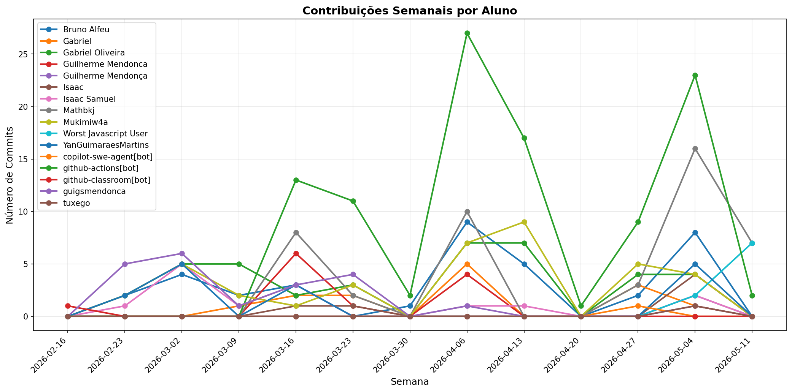

# 📊 Relatório de Contribuições do Projeto

**Última atualização:** 18/05/2026 22:19

---

## 📈 Resumo Geral de Contribuições

| Aluno                  |   Commits |   Linhas+ |   Linhas- |   Arquivos |   Docs Commits |   Docs Arquivos |
|------------------------|-----------|-----------|-----------|------------|----------------|-----------------|
| Bruno Alfeu            |        36 |      1967 |       659 |         45 |             17 |               6 |
| Gabriel                |        14 |    101429 |       359 |        174 |              0 |               0 |
| Gabriel Oliveira       |        39 |       517 |        93 |         14 |             32 |               6 |
| Guilherme Mendonca     |        11 |      1079 |       362 |         20 |              9 |               3 |
| Guilherme Mendonça     |         2 |       768 |         8 |         19 |              1 |               2 |
| Isaac                  |         6 |      1732 |       582 |         31 |              0 |               0 |
| Isaac Samuel           |        14 |        89 |        76 |          6 |             12 |               5 |
| Mathbkj                |        46 |     50432 |   5267363 |      35128 |              3 |               1 |
| Mukimiw4a              |        38 |      1327 |       235 |         31 |             28 |               9 |
| Worst Javascript User  |         9 |        10 |   5260287 |      34855 |              3 |               2 |
| YanGuimaraesMartins    |        15 |      1240 |       451 |         10 |             10 |               5 |
| copilot-swe-agent[bot] |         1 |         0 |         0 |          0 |              0 |               0 |
| github-actions[bot]    |       105 |       809 |       785 |          3 |            105 |               1 |
| github-classroom[bot]  |         1 |      2152 |         0 |         45 |              1 |              13 |
| guigsmendonca          |        21 |       178 |       150 |          9 |             16 |               4 |
| tuxego                 |         1 |   5263498 |         1 |      34971 |              0 |               0 |

## 📅 Contribuições Semanais (Todo o Semestre)

**2026-05-11**: Mathbkj: 7, Worst Javascript User: 7, github-actions[bot]: 2

**2026-05-04**: Bruno Alfeu: 8, Gabriel: 1, Gabriel Oliveira: 4, Guilherme Mendonça: 2, Isaac: 4, Isaac Samuel: 2, Mathbkj: 16, Mukimiw4a: 4, Worst Javascript User: 2, YanGuimaraesMartins: 5, github-actions[bot]: 23, guigsmendonca: 1, tuxego: 1

**2026-04-27**: Bruno Alfeu: 2, Gabriel: 3, Gabriel Oliveira: 4, Mathbkj: 3, Mukimiw4a: 5, copilot-swe-agent[bot]: 1, github-actions[bot]: 9

**2026-04-20**: github-actions[bot]: 1

**2026-04-13**: Bruno Alfeu: 5, Gabriel Oliveira: 7, Isaac Samuel: 1, Mukimiw4a: 9, github-actions[bot]: 17

**2026-04-06**: Bruno Alfeu: 9, Gabriel: 5, Gabriel Oliveira: 7, Guilherme Mendonca: 4, Isaac Samuel: 1, Mathbkj: 10, Mukimiw4a: 7, github-actions[bot]: 27, guigsmendonca: 1

**2026-03-30**: Bruno Alfeu: 1, github-actions[bot]: 2

**2026-03-23**: Gabriel: 2, Gabriel Oliveira: 3, Guilherme Mendonca: 1, Isaac: 1, Mathbkj: 2, Mukimiw4a: 3, github-actions[bot]: 11, guigsmendonca: 4

**2026-03-16**: Bruno Alfeu: 3, Gabriel: 2, Gabriel Oliveira: 2, Guilherme Mendonca: 6, Isaac: 1, Isaac Samuel: 3, Mathbkj: 8, Mukimiw4a: 1, YanGuimaraesMartins: 3, github-actions[bot]: 13, guigsmendonca: 3

**2026-03-09**: Bruno Alfeu: 2, Gabriel: 1, Gabriel Oliveira: 5, Isaac Samuel: 1, Mukimiw4a: 2, guigsmendonca: 1

**2026-03-02**: Bruno Alfeu: 4, Gabriel Oliveira: 5, Isaac Samuel: 5, Mukimiw4a: 5, YanGuimaraesMartins: 5, guigsmendonca: 6

**2026-02-23**: Bruno Alfeu: 2, Gabriel Oliveira: 2, Isaac Samuel: 1, Mukimiw4a: 2, YanGuimaraesMartins: 2, guigsmendonca: 5

**2026-02-16**: github-classroom[bot]: 1

## 📊 Visualização Gráfica

## ℹ️ Observações

- **Commits**: Número total de commits realizados

- **Linhas+**: Linhas de código adicionadas

- **Linhas-**: Linhas de código removidas

- **Arquivos**: Número de arquivos únicos modificados

- **Docs Commits**: Commits em arquivos de documentação

- **Docs Arquivos**: Arquivos de documentação modificados

---

*Relatório gerado automaticamente via GitHub Actions*
