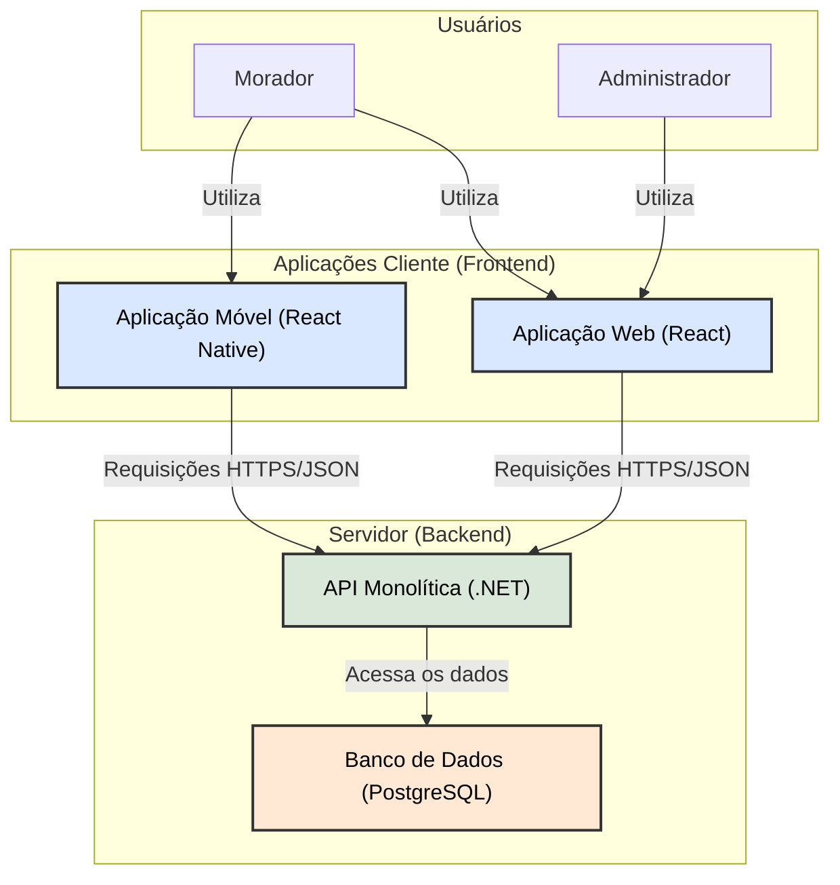

# Introdução

A crescente verticalização das cidades brasileiras tem transformado a dinâmica da vida em comunidade, intensificando a complexidade da administração condominial. Com isso, métodos de gestão tradicionais, muitas vezes manuais, tornaram-se fontes de ineficiência e atrito entre os moradores.

Dentre os desafios operacionais, o gerenciamento da reserva de áreas comuns é um dos processos mais sensíveis. A utilização de controles analógicos frequentemente resulta em conflitos, falta de transparência e sobrecarga administrativa para a gestão.

Este projeto aborda diretamente esse cenário, propondo o desenvolvimento de um sistema de software distribuído, o "Gestão Integrada de Condomínios". O objetivo é conceber e planejar uma solução tecnológica que otimize e automatize processos administrativos, com foco na modernização do sistema de reservas, oferecendo uma plataforma centralizada e transparente para todos os envolvidos.

## Problema
A gestão de áreas comuns em condomínios residenciais, como salões de festa, churrasqueiras e quadras esportivas, é frequentemente realizada de forma manual e descentralizada. Processos baseados em livros de registro na portaria, planilhas compartilhadas ou trocas de mensagens informais com o síndico ou zelador são comuns. Este cenário gera uma série de problemas:

*   **Conflitos de Agendamento (Double Booking):** A falta de um sistema centralizado e em tempo real leva a erros, como a reserva da mesma área por dois moradores para a mesma data e horário.
*   **Falta de Transparência:** Os moradores não têm uma visão clara da disponibilidade das áreas, das regras de utilização ou do histórico de reservas, dependendo sempre da consulta a um intermediário.
*   **Sobrecarga Administrativa:** O síndico, zelador ou porteiro dedicam um tempo considerável para gerenciar pedidos, consultar disponibilidades, registrar reservas e comunicar os moradores, um trabalho repetitivo e de baixo valor agregado.
*   **Falhas na Comunicação:** A ausência de um canal oficial para confirmação e lembrete das reservas pode causar mal-entendidos e o não cumprimento de regras associadas ao uso dos espaços.

## Objetivos

#### Objetivo Geral
Desenvolver um sistema de software distribuído para a gestão integrada de condomínios, com foco na automação e otimização do processo de reserva de áreas comuns.

#### Objetivos Específicos
*   Implementar uma API RESTful monolítica utilizando .NET que centralize as regras de negócio para o cadastro de usuários (moradores, administradores), áreas comuns e o gerenciamento de reservas.
*   Desenvolver uma interface web responsiva com React, permitindo que administradores gerenciem as áreas e que moradores consultem a disponibilidade, realizem e gerenciem suas próprias reservas de forma autônoma.
*   Projetar e desenvolver uma aplicação móvel (framework a definir) que ofereça aos moradores a conveniência de realizar e consultar suas reservas a qualquer momento e lugar.
  
## Justificativa

O crescimento da população urbana e a verticalização das cidades resultaram em um aumento significativo no número de condomínios residenciais. Segundo dados do IBGE (2022), a proporção de brasileiros vivendo em apartamentos cresceu de 7,6% em 2000 para 12,5% em 2022. Com isso, a complexidade da gestão condominial aumentou, tornando os métodos tradicionais insuficientes.

A administração manual do processo de reservas, especificamente, é uma fonte constante de ineficiência e insatisfação. Ela não só consome tempo valioso da equipe administrativa como também gera atritos na comunidade devido a erros e falta de clareza. A implementação de um sistema automatizado agrega valor diretamente ao negócio do condomínio ao:

*   **Aumentar a eficiência operacional:** Reduz o tempo gasto em tarefas manuais.
*   **Melhorar a satisfação do morador:** Oferece conveniência, autonomia e transparência, melhorando a experiência de viver em comunidade.
*   **Promover a utilização justa e organizada dos espaços:** Garante que as regras sejam aplicadas de forma consistente para todos.

Este projeto se justifica pela oportunidade de aplicar tecnologia para resolver um problema real e recorrente, gerando um impacto positivo direto na qualidade de vida e na convivência dos moradores, ao mesmo tempo em que otimiza a gestão de recursos para a administração.

## Público-Alvo

O público-alvo é dividido em dois perfis principais de acesso, conforme definido no **RF-001**, com diferentes níveis de autoridade e interação com a tecnologia.

### **A. Perfil Morador (Usuário Final)**
* **Perfil:** Indivíduos de diversas faixas etárias que residem no condomínio. 
* **Conhecimentos Prévios:** Familiaridade básica com smartphones e navegação web (uso de redes sociais, apps de banco ou delivery).
* **Relação com a Tecnologia:** Buscam agilidade e autonomia. Preferem o **aplicativo móvel** para ações rápidas e o **calendário visual (RF-003)** para evitar interações burocráticas com a portaria.
* **Objetivo:** Realizar e gerenciar reservas de áreas comuns sem atritos, recebendo confirmações em tempo real (**RF-008**).

### **B. Perfil Administrador (Gestão)**
* **Perfil:** Síndicos (eleitos ou profissionais) e membros da administradora do condomínio.
* **Conhecimentos Prévios:** Familiaridade com ferramentas de gestão, planilhas e sistemas de controle administrativo.
* **Relação com a Tecnologia:** Utilizam predominantemente a **aplicação web em React** via desktop. Valorizam a integridade dos dados e a capacidade de moderação (**RF-007**).
* **Objetivo:** Configurar as regras do condomínio (**RF-002**) e garantir que o uso dos espaços seja justo e organizado, evitando conflitos de agendamento (**RF-005**).

---

## 2. Personas

As personas abaixo representam os extremos de uso do sistema para garantir que a **RNF-002 (Interface Intuitiva)** seja atendida.

### **Persona 1: O Morador "Early Adopter"**
> *"Quero reservar a churrasqueira agora para o próximo sábado sem ter que ligar para ninguém."*
* **Nome:** Lucas, 29 anos.
* **Profissão:** Analista de Marketing.
* **Comportamento:** Extremamente conectado, realiza 90% de suas tarefas via mobile. 
* **Dor:** Detesta processos manuais ou ter que assinar livros físicos na portaria.
* **Necessidade no Sistema:** Autenticação rápida via **JWT**, calendário visual fluido e confirmação imediata por notificação.

### **Persona 2: A Síndica Moderadora**
> *"Preciso garantir que as regras de uso sejam respeitadas para manter a boa convivência no prédio."*
* **Nome:** Helena, 52 anos.
* **Profissão:** Aposentada e Síndica Moradora.
* **Comportamento:** Organizada e rigorosa com horários. Prefere usar o computador para visualizar o cronograma completo do mês.
* **Dor:** Conflitos entre vizinhos por causa de reservas duplicadas ou uso indevido de espaços.
* **Necessidade no Sistema:** Painel administrativo para **aprovar ou rejeitar reservas (RF-007)** e definir as capacidades e regras de cada área (**RF-002**).

---

## 3. Mapa de Stakeholders

O sucesso do projeto depende do engajamento de diferentes partes interessadas:

| Stakeholder | Tipo | Interesse / Expectativa |
| :--- | :--- | :--- |
| **Moradores** | Interno | Transparência na disponibilidade e facilidade de agendamento. |
| **Síndico / Conselho** | Interno | Redução da sobrecarga administrativa e automação de processos. |
| **Zeladores / Porteiros** | Interno | Consulta rápida de quem está autorizado a usar as áreas no dia. |
| **Administradora** | Externo | Dados precisos para prestação de contas e histórico de uso. |
| **Equipe de Dev (.NET)** | Técnico | Garantir a escalabilidade da API e a segurança HTTPS (**RNF-003**). |

---

# Especificações do Projeto

## Requisitos

### Requisitos Funcionais

| ID | Descrição do Requisito | Prioridade |
|---|---|---|
| RF-001 | O sistema deve permitir o cadastro e autenticação de usuários com perfis de 'Administrador' e 'Morador'. | ALTA |
| RF-002 | O sistema deve permitir que o 'Administrador' cadastre, visualize, edite e remova áreas comuns (ex: nome, capacidade, regras de uso). | ALTA |
| RF-003 | O sistema deve permitir que o 'Morador' consulte a disponibilidade de áreas comuns através de um calendário visual. | ALTA |
| RF-004 | O sistema deve permitir que o 'Morador' realize uma reserva para uma área comum em uma data e horário disponíveis. | ALTA |
| RF-005 | O sistema deve impedir a criação de reservas em horários já ocupados ou fora das regras estabelecidas para a área. | ALTA |
| RF-006 | O sistema deve permitir que o 'Morador' visualize e cancele suas próprias reservas futuras. | MÉDIA |
| RF-007 | O sistema deve permitir que o 'Administrador' visualize, aprove, rejeite ou cancele qualquer reserva no sistema. | MÉDIA |
| RF-008 | O sistema deve enviar uma notificação (email ou push) para o morador ao confirmar ou cancelar uma reserva. | BAIXA |
| RF-009 | O sistema deve permitir que o 'Morador' abra um chamado de ocorrência/manutenção, descrevendo o problema e anexando uma foto. | MÉDIA |
| RF-010 | O sistema deve permitir que o 'Administrador' visualize, atualize o status (ex: "Aberto", "Em andamento", "Resolvido") e finalize as ocorrências. | MÉDIA |
| RF-011 | O sistema deve permitir que o 'Administrador' (ou 'Porteiro', se criarmos esse perfil) registre a chegada de uma encomenda para um morador/unidade. | MÉDIA |
| RF-012 | O sistema deve notificar o morador sobre a chegada de uma encomenda. | BAIXA |
| RF-013 | O sistema deve permitir que o 'Administrador' (ou 'Porteiro') dê baixa na encomenda no momento da retirada pelo morador. | MÉDIA |

### Requisitos não Funcionais

| ID | Descrição do Requisito | Prioridade |
|---|---|---|
| RNF-001 | A aplicação web deve ser responsiva, garantindo usabilidade em desktops, tablets e smartphones. | ALTA |
| RNF-002 | O sistema deve ter uma interface intuitiva e de fácil aprendizado para os diferentes perfis de usuário. | ALTA |
| RNF-003 | A comunicação entre os clientes (web/mobile) e a API deve ser criptografada utilizando o protocolo HTTPS. | ALTA |
| RNF-004 | O tempo de resposta para a consulta de disponibilidade no calendário não deve exceder 2 segundos em condições normais de uso. | MÉDIA |
| RNF-005 | O sistema deve ser compatível com os navegadores Google Chrome, Mozilla Firefox e Microsoft Edge em suas duas versões mais recentes. | MÉDIA |
| RNF-006 | A autenticação de usuários no sistema deverá ser baseada em JSON Web Tokens (JWT), garantindo comunicação stateless. | ALTA |

## Restrições

O projeto está restrito pelo item apresentados na tabela a seguir.

| ID | Restrição |
|---|---|
| 01 | O projeto deverá ser entregue na sua totalidade (código-fonte, documentação e apresentação) até a data limite estipulada no cronograma do semestre. |

# Catálogo de Serviços

Baseado nos conceitos de Gestão de Serviços de TI (ITSM), o projeto oferecerá os seguintes serviços de TI para dar suporte aos processos de negócio do condomínio:

| Serviço | Descrição | Funcionalidades de Negócio Suportadas |
| :--- | :--- | :--- |
| **Gestão de Identidade e Acesso** | Provê os meios para que usuários sejam autenticados e autorizados a acessar apenas as funcionalidades de seus perfis. | Login, Gestão de Perfis (Morador, Admin). |
| **Agendamento de Recursos** | Serviço central que permite aos moradores consumir o recurso de negócio "Reserva de Áreas Comuns" de forma automatizada. | Consulta de disponibilidade, criação, visualização e cancelamento de reservas. |
| **Portfólio de Recursos** | Permite que a administração gerencie os ativos (áreas comuns) que serão disponibilizados para reserva no serviço de agendamento. | Cadastro, edição e remoção de áreas comuns e suas regras. |
| **Gestão de Ocorrências** | Facilita a comunicação e resolução de problemas de manutenção, permitindo o registro e acompanhamento de chamados. | Abertura de chamados de manutenção, atualização de status e histórico. |
| **Controle de Entregas** | Automatiza o processo de recebimento e retirada de encomendas na portaria, garantindo rastreabilidade e notificação. | Registro de chegada de pacotes, notificação ao morador e registro de retirada. |
| **Notificação** | Mantém os usuários informados sobre o status de suas solicitações de serviço (reservas, ocorrências, entregas). | Envio de e-mails ou notificações push para confirmações e alertas. |

# Arquitetura da Solução

A arquitetura da solução seguirá um modelo monolítico de 3 camadas, que é uma abordagem robusta e comprovada para sistemas como o nosso. Os componentes estão distribuídos, mas a lógica de negócio permanece centralizada em uma única API, conforme a restrição do projeto.

O diagrama abaixo ilustra a interação entre os componentes da arquitetura.

*   **Aplicações Cliente (Frontend):**
*   **Aplicação Web (React):** Interface rica e responsiva, acessada via navegador. Será a principal ferramenta para os **Administradores**, oferecendo painéis de controle, relatórios e gestão completa das áreas, reservas e ocorrências. Os moradores também poderão usá-la.
*   **Aplicação Móvel (React Native):** Focada na conveniência e agilidade para o **Morador**. Permitirá realizar e consultar reservas, abrir ocorrências e receber notificações de forma rápida em dispositivos iOS e Android.

*   **Servidor (Backend):**
*   **API Monolítica (.NET):** O cérebro do sistema. Será uma única aplicação responsável por toda a lógica de negócio: autenticação de usuários (via JWT), validação de regras de reserva, gerenciamento de áreas, ocorrências e entregas. Ela expõe os dados e funcionalidades de forma segura através de endpoints RESTful.
*   **Banco de Dados (PostgreSQL):** O repositório central de informações. Armazenará todos os dados de forma estruturada, incluindo usuários, áreas comuns, reservas, ocorrências, etc. A API será a única responsável por se comunicar com o banco de dados, garantindo a integridade e a segurança dos dados.

## Tecnologias Utilizadas

Descreva aqui qual(is) tecnologias você vai usar para resolver o seu problema, ou seja, implementar a sua solução. Liste todas as tecnologias envolvidas, linguagens a serem utilizadas, serviços web, frameworks, bibliotecas, IDEs de desenvolvimento, e ferramentas.

Apresente também uma figura explicando como as tecnologias estão relacionadas ou como uma interação do usuário com o sistema vai ser conduzida, por onde ela passa até retornar uma resposta ao usuário.

## Hospedagem

Explique como a hospedagem e o lançamento da plataforma foi feita.
