# Front-end Móvel

O Front-end Móvel do projeto **Gestão Integrada de Condomínios (Modernidade Soft)** foi planejado para oferecer uma experiência prática e intuitiva para moradores e perfis administrativos em contexto de uso diário no smartphone. O objetivo é centralizar, em uma navegação simples, os fluxos essenciais do condomínio: autenticação, acompanhamento de avisos e atualizações, registro de ocorrências, realização de reservas e gestão de usuários.

A proposta mobile prioriza rapidez nas tarefas mais frequentes e clareza na leitura de informações operacionais. Com isso, o aplicativo reduz a dependência de canais informais (mensagens e comunicados dispersos), melhora a comunicação entre administração e condôminos e aumenta a visibilidade sobre solicitações e serviços do condomínio.

## Projeto da Interface
O projeto da interface móvel foi estruturado com foco em **usabilidade em telas pequenas**, mantendo consistência entre módulos e reduzindo a curva de aprendizado para usuários não técnicos. A navegação principal ocorre por meio de **barra inferior fixa** (Dashboard, Reservas, Ocorrências e Gestão), complementada por ações contextuais no topo das telas (notificações, configurações e busca).

As páginas seguem um padrão visual baseado em cards, blocos de ação e indicadores de status, facilitando o escaneamento rápido. O fluxo foi desenhado para refletir o dia a dia condominial:
- **Login:** entrada segura na plataforma com foco em acesso rápido.
- **Dashboard:** visão geral de atalhos e atualizações recentes.
- **Reservas:** seleção de ambiente, data e faixa de horário com validações de disponibilidade.
- **Ocorrências:** acompanhamento de chamados por status, data e categoria.
- **Gestão:** controle de usuários ativos/inativos e permissões de acesso.

As interações priorizam toques únicos, feedback visual imediato e componentes reutilizáveis (botões primários, toggles, chips de filtro e cards informativos), garantindo previsibilidade de uso entre as telas.

### Wireframes

Os wireframes abaixo representam as páginas principais da experiência móvel e a disposição dos elementos de interface:

#### Login

#### Dashboard

#### Reservas

#### Ocorrências

#### Gestão de Usuários

### Design Visual

O estilo visual adota linguagem contemporânea, com predominância de tons de azul, cinza e branco para transmitir confiança, organização e leitura limpa. A hierarquia de informações é construída com contraste moderado, uso de espaçamento amplo e cards com cantos arredondados, mantendo a interface leve e amigável.

A tipografia sem serifa favorece legibilidade em diferentes tamanhos de tela, com títulos em peso mais forte para destacar ações críticas (ex.: confirmar reserva, criar usuário, registrar ocorrência). Os ícones são usados como apoio funcional para navegação e reconhecimento rápido de contexto (menu, alertas, manutenção, usuários e reserva).

Também foram definidos padrões visuais para estados e feedbacks:
- chips de status para ocorrências (aberto, em análise, finalizado);
- botões primários em destaque para ações de confirmação;
- toggles para ativação/inativação de usuários;
- blocos informativos para atualizações recentes e indicadores operacionais.

Esse conjunto garante consistência entre telas e reforça a proposta de uma experiência móvel objetiva para operações condominiais do dia a dia.

## Fluxo de Dados

### Carregamento
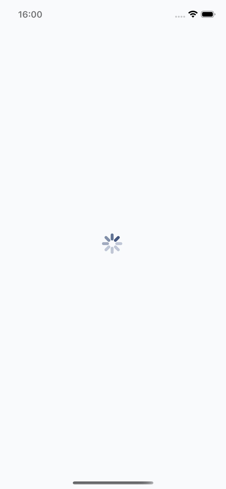
 
Ao entrar no aplicativo o usuário é direcionado para a tela de carregamento, onde um ícone de spinner nativo do sistema aparece girando enquanto a aplicação está sendo efetivamente carregada.

### Login
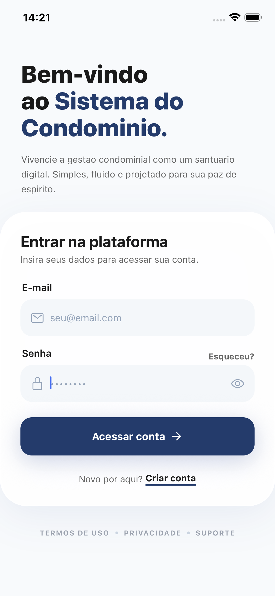

Após a tela carregar o usuário é redirecionado para a tela de login. O usuário pode inserir as informações de email e senha nos campos para fazer o login. Caso ainda não tenha um login, basta pressionar o botão nomeado "Criar conta" para ser redirecionado à tela de cadastro. Ao ter inserido as informações nos campos basta que o usuário pressione o botão "Acessar conta" para efetuar o login. Ao efetuar o login será redirecionado à tela de dashboard.

### Cadastro

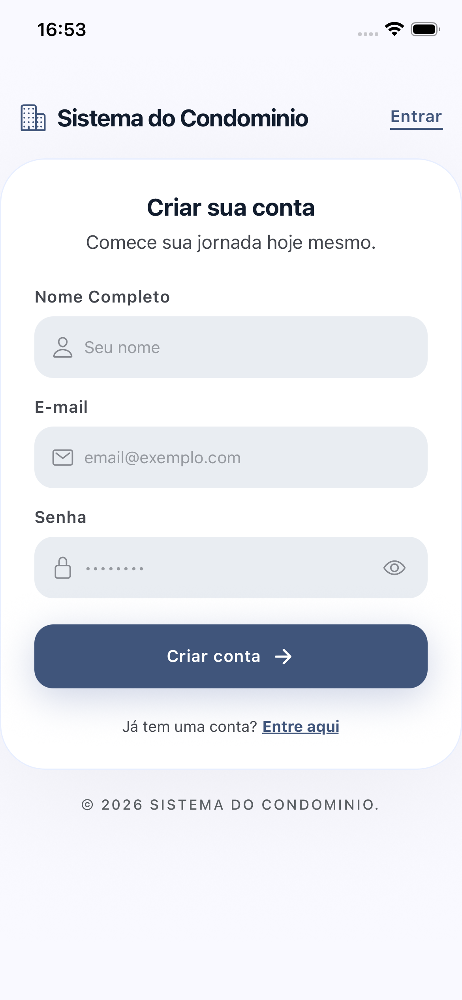

Na tela de cadastro o usuário deve informar suas credenciais nos campos. Essas credenciais são o nome completo, email e senha que serão utilizadas para acessar tanto a aplicação web quanto o aplicativo para dispositivos móveis. Uma vez que tenha inserido seus dados nos campos basta pressionar o botão "Criar conta" e o usuário será redirecionado para a tela de login, onde poderá prosseguir inserindo as informações cadastradas na tela de cadastro.

### Dashboard
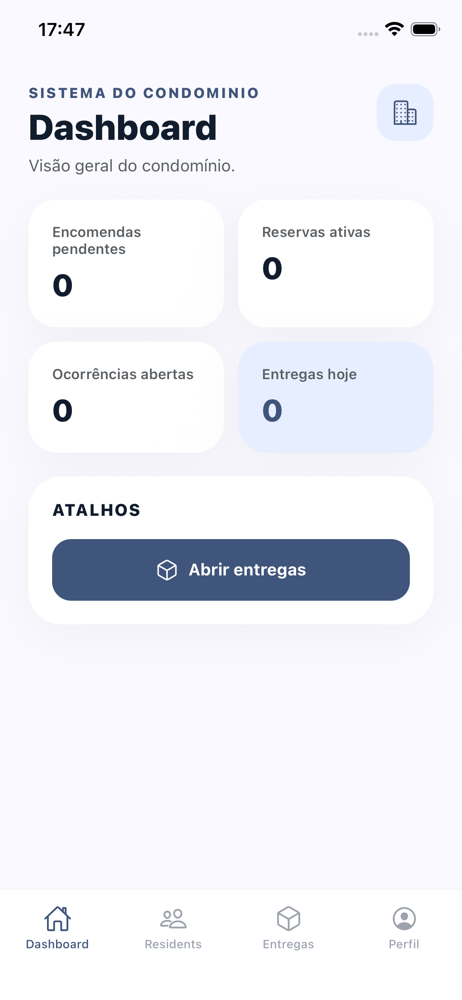

Em dashboard o usuário pode verificar informações gerais destinadas ao seu perfil. É possível verificar informações quantitativas sobre suas encomendas, reservas, ocorrências e entregas. Fora isso existe um botão de atalho para o usuário ser redirecionado diretamente para a tela de entregas.

Como pode-se verificar, na parte inferior da tela existem as abas para as quais o usuário pode navegar. Essas abas estão presentes no aplicativo todo a partir do momento em que o usuário está logado. Ao navegar para uma das abas o conteúdo central da tela muda de acordo com o conteúdo da aba.

### Entregas
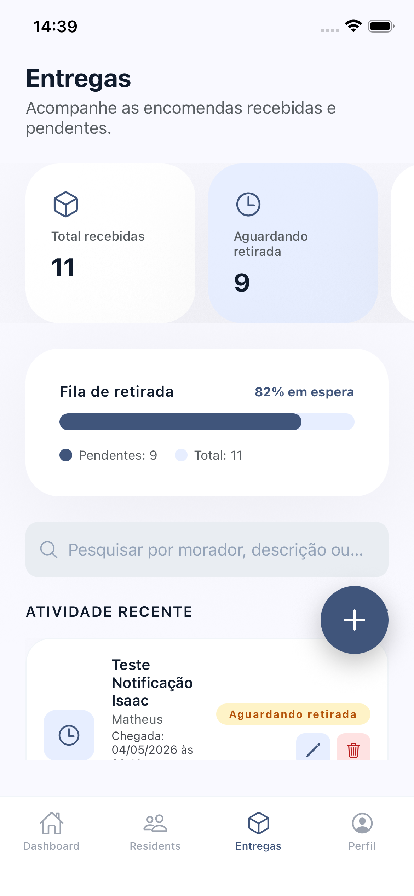
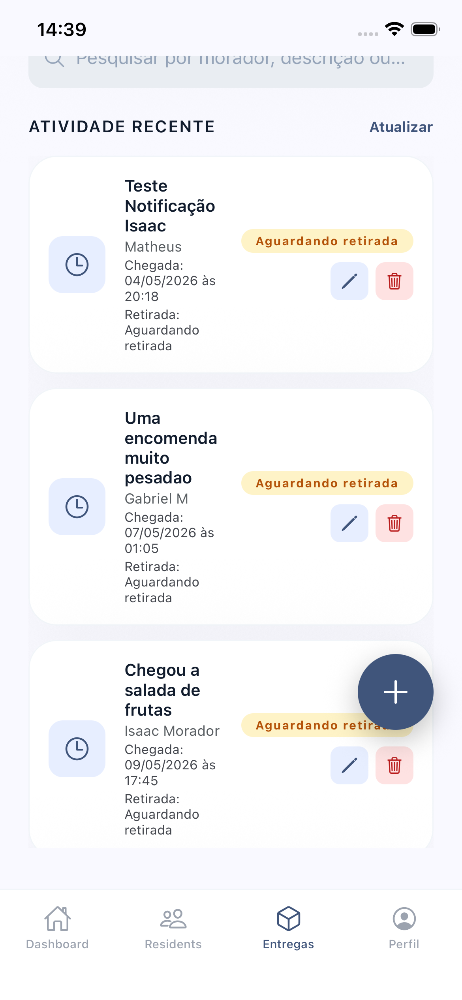
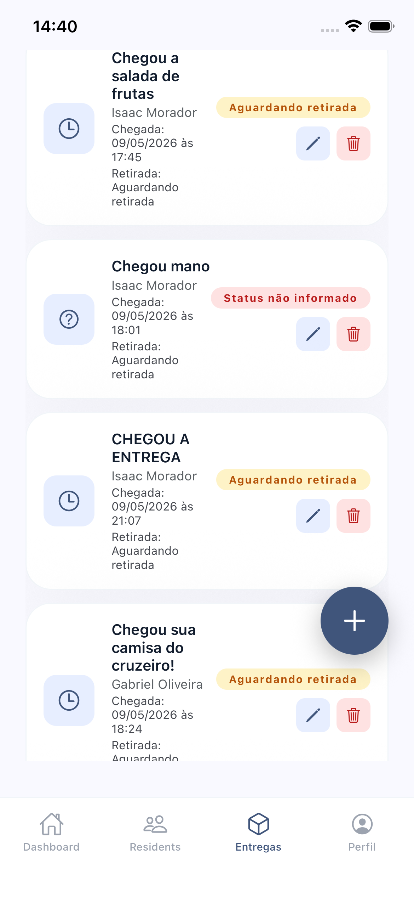
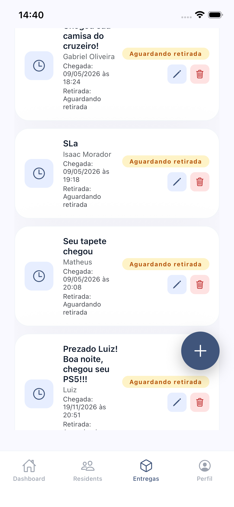
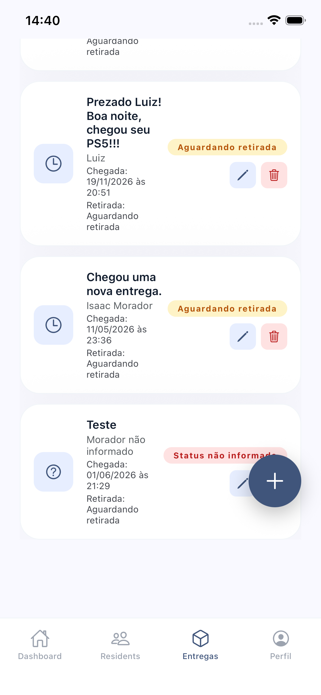

Na tela de entregas o usuário pode verificar as informações de encomendas que chegaram ao condomínio. Como não foi possível capturar a tela de entregas inteira com apenas um print, foram feitas diversas capturas de tela do início ao final do conteúdo disponível para ser possível visualizar todo o fluxo.

É possível visualizar o total de encomendas recebidas e as que estão aguardando retirada. Para essa visualização são demonstrados números e a porcentagem de encomendas em espera na fila de retirada.

Para filtrar encomendas é exibida uma barra de pesquisa, que permite ao usuário pesquisar por termos e obter somente entregas que possuem algum tipo de relação nos termos do que foi pesquisado.

Abaixo da barra de pesquisa existe um menu de atividade recente que mostra as informações das encomendas. As encomendas registradas há mais tempo ficam no topo da lista e as mais recentes ficam mais próximas ao fim da lista.

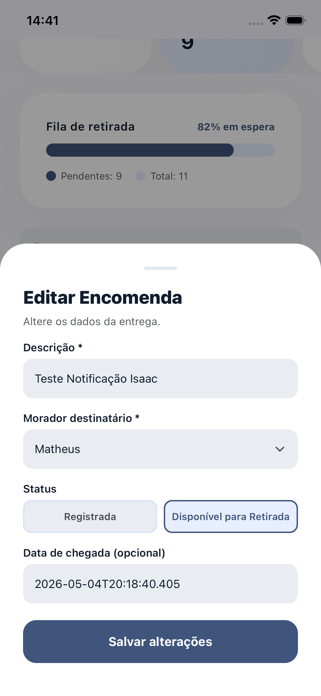

Para usuários com cargo de Administrador é possível editar informações de entregas. Para isso basta o usuário pressionar o botão azul com ícone de lápis localizado na parte direita das informações sobre uma entrega. Ao pressionar este botão será aberto um menu contendo as informações atuais da entrega. Para efetivar uma alteração basta pressionar o botão "Salvar alterações".

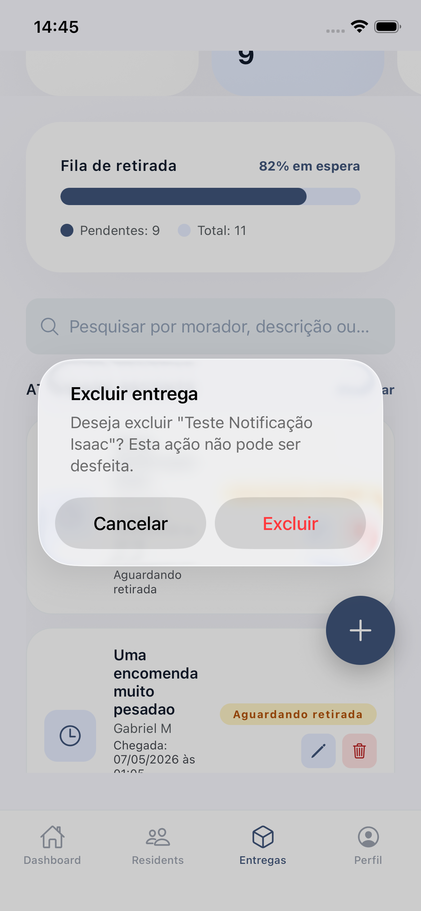

Para usuários com cargo de Administrador é possível excluir informações sobre uma entrega. Para isso basta o usuário pressionar o botão vermelho com ícone de lixeira localizado à direita do ícone de edição. Ao pressionar este botão será mostrada uma modal de confirmação para a exclusão da informação. Caso o usuário deseje realmente excluir basta pressionar o botão "Excluir", mas se clicou por acidente ou deseja cancelar a operação basta pressionar o botão "Cancelar" para voltar à tela normal e manter as informações da entrega.

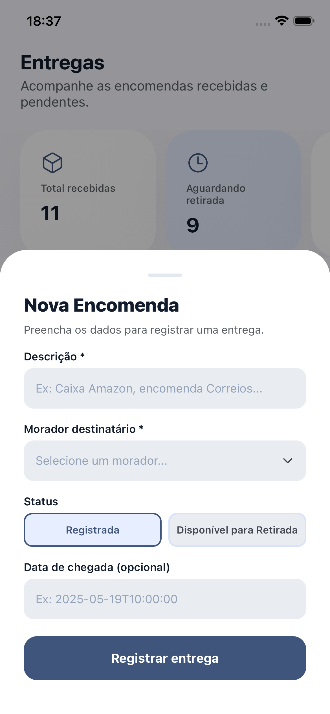

Para usuários com cargo de Administrador é disponibilizado um botão no canto inferior direito da tela de entregas. Esse botão, ao ser clicado, abre um menu que permite registrar uma nova encomenda no sistema. Para isso, devem ser preenchidos os campos de descrição do produto, morador destinatário e status da entrega. 

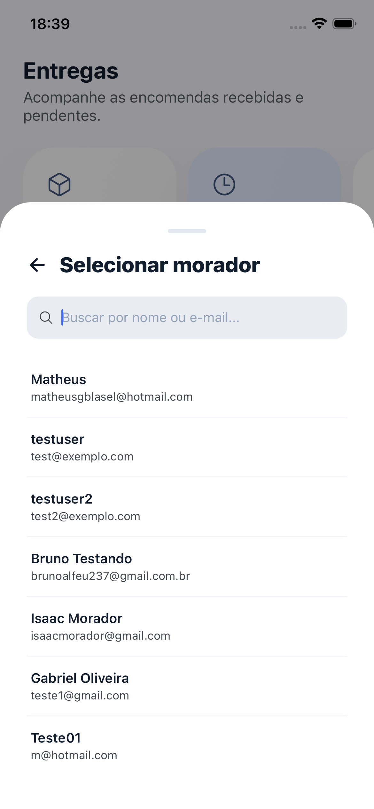

Para selecionar o morador existe um menu de dropdown que ao ser pressionado mostra todos os moradores existentes. É possível também buscar um morador pelo campo de pesquisa derivado do menu de dropdown.

O campo de  data de chegada é opcional por ser preenchido automaticamente com o horário atual caso seja deixado em branco. Ao pressionar o botão "Registrar entrega" a encomenda é registrada no sistema e o menu se fecha.

## Tecnologias Utilizadas

Para o desenvolvimento da interface do aplicativo para dispositivo móvel, tanto em sistemas IOS como Android, e de acordo com a proposta do projeto, foram selecionadas as seguintes tecnologias:

### 🏗️ Expo
Framework baseado na tecnologia React Native para desenvolvimento de aplicações mobile. Essa ferramenta é considerada "cross-platform", o que significa que é possível desenvolver tanto para sistemas IOS como Android. Um diferencial do Expo é que ele possui integração para fazer o bundle(versão funcional do código-fonte) e disponibilizar a aplicação na Play Store e na App Store, o que otimiza o processo de construção do app. 

## Considerações de Segurança

[Discuta as considerações de segurança relevantes para a aplicação distribuída, como autenticação, autorização, proteção contra ataques, etc.]

## Implantação

[Instruções para implantar a aplicação distribuída em um ambiente de produção.]

1. Defina os requisitos de hardware e software necessários para implantar a aplicação em um ambiente de produção.
2. Escolha uma plataforma de hospedagem adequada, como um provedor de nuvem ou um servidor dedicado.
3. Configure o ambiente de implantação, incluindo a instalação de dependências e configuração de variáveis de ambiente.
4. Faça o deploy da aplicação no ambiente escolhido, seguindo as instruções específicas da plataforma de hospedagem.
5. Realize testes para garantir que a aplicação esteja funcionando corretamente no ambiente de produção.

## Testes

[Descreva a estratégia de teste, incluindo os tipos de teste a serem realizados (unitários, integração, carga, etc.) e as ferramentas a serem utilizadas.]

1. Crie casos de teste para cobrir todos os requisitos funcionais e não funcionais da aplicação.
2. Implemente testes unitários para testar unidades individuais de código, como funções e classes.
3. Realize testes de integração para verificar a interação correta entre os componentes da aplicação.
4. Execute testes de carga para avaliar o desempenho da aplicação sob carga significativa.
5. Utilize ferramentas de teste adequadas, como frameworks de teste e ferramentas de automação de teste, para agilizar o processo de teste.

# Referências

Inclua todas as referências (livros, artigos, sites, etc) utilizados no desenvolvimento do trabalho.
