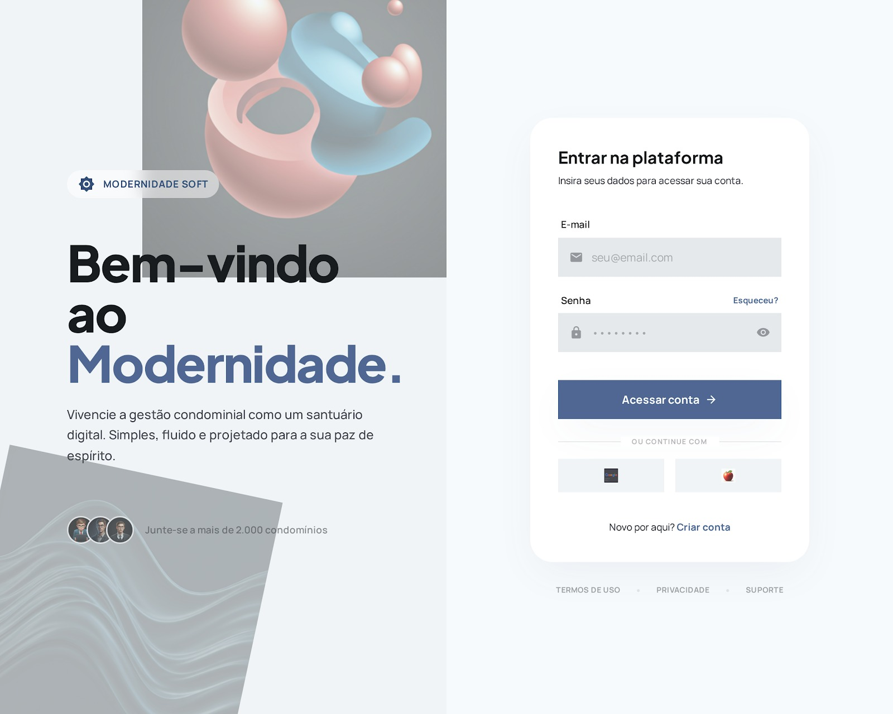
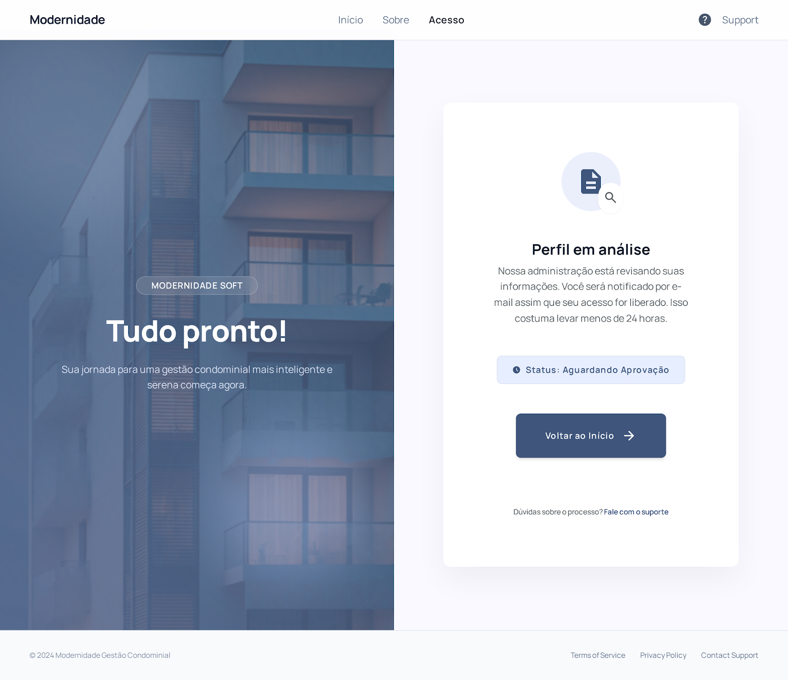
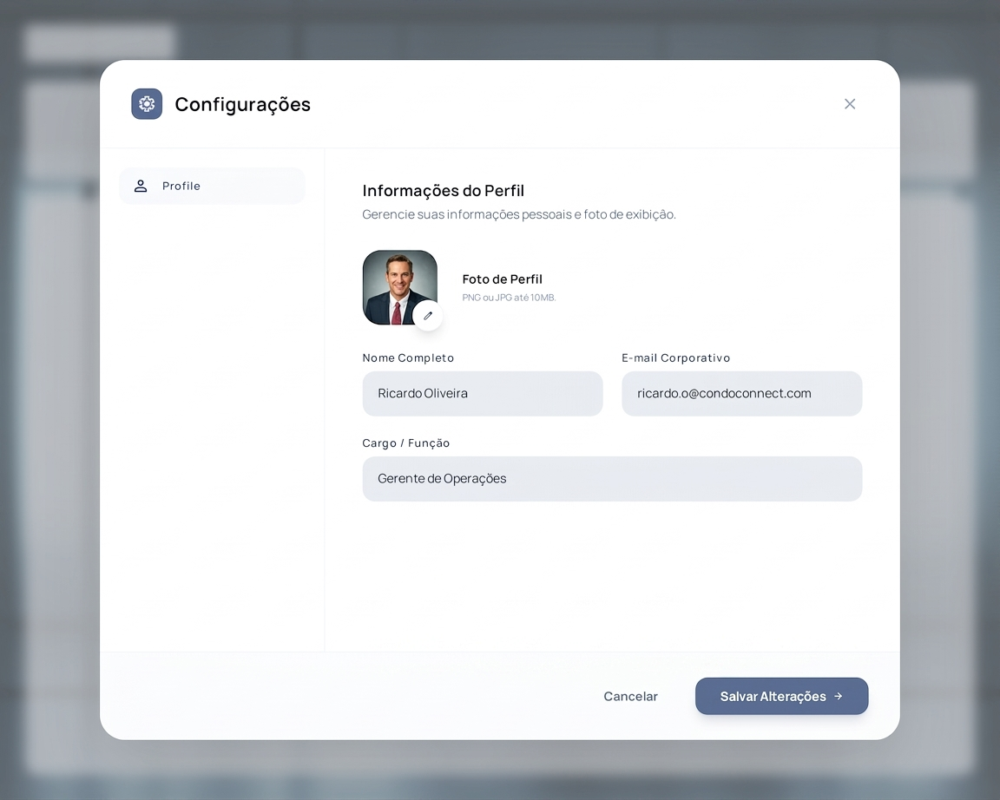

# Front-end Web

[Inclua uma breve descrição do projeto e seus objetivos.]

## Projeto da Interface Web

[Descreva o projeto da interface Web da aplicação, incluindo o design visual, layout das páginas, interações do usuário e outros aspectos relevantes.]

### Wireframes

[Inclua os wireframes das páginas principais da interface, mostrando a disposição dos elementos na página.]

### Design Visual

[Descreva o estilo visual da interface, incluindo paleta de cores, tipografia, ícones e outros elementos gráficos.]

## Fluxo de Dados

### Login

Ao acessar a tela de login, o usuário deverá inserir suas credenciais de email e senha e pressionar o botão "Acessar Conta" para efetuar o login na aplicação. Quando o usuário estiver logado, será redirecionado para a tela de dashboard da aplicação. Há uma botão para o usuário criar sua conta caso ainda não tenha uma. Ao clicar para criar uma conta, será redirecionado para a tela de cadastro.

### Cadastro

Ao acessar a tela de cdastro, o usuário deverá registar suas credenciais de nome, email e senha. Ao clicar em "Criar Conta", o usuário será redirecionado para uma tela informando que o seu perfil foi enviado para análise para aprovação. Há as opções para cadastrar-se pelos provedores da Google ou Apple. Ao clicar para se cadastrar com o Google será enviada uma notificação para aprovação do perfil. Ao clicar para se cadastrar com a Apple, o usuário será redirecionado para o site da Apple e por fim será enviada a notificação para aprovação do perfil pelo síndico

É possível ao usuário clicar na parte "Entrar" para voltar à página de login.

### Aprovação

Trata-se da tela de aprovação. Por meio dessa tela o usuário é informado que seu perfil foi enviado para ser analisado e posteriormente recusado ou aprovado. Ao clicar em "Voltar ao Início", o usuário será redirecionado à página de cadastro.

### Dashboard

Quando o usuário tiver acessado a plataforma, cairá na tela de dashboard. Nesta tela, o usuário poderá navegar para as outras telas por meio da barra de navegação lateral ou pelo conteúdo central. O usuário pode navegar para a tela de reservas, ocorrências ou gestão. Ao clicar sobre avisos aparecerá um conteúdo de modal mostrando as notificações existentes para o usuário.

Na parte inferior esquerda, o usuário pode checar as notificações mais recentes. Na parte inferior direita, o usuário pode checar pelas reservas mais próximas feitas por ele. No final da parte inferior direita é possível verificar o gerenciamento do consumo de recursor e compará-lo com a média.

Para acessar a tela do menu de notificações é possível clicar no ícone de notificação na barra superior, ao lado da barra de pesquisa. Para acessar ao menu de configurações principal, o usuário precisará clicar no ícone de engrenagem, sendo redirecionado para a tela de configurações.

### Configuração

Na tela de configuração, o usuário pode alterar a foto de perfil, o nome completo, o nome corporativo e o cargo escolhido. Após as alterações, basta clicar em "Salvar Alterações". Ao salvar as alterações o usuário é redirecionado para a página anterior e as alterações são efetivadas. Para simplesmente voltar à tela anterior e não alterar nada, basta clicar em "Cancelar".

### Modal Avisos

Uma vez que o usuário clique em avisos, na tela de dashboard, aparecerá uma modal contendo os avisos mais importantes por ordem de proximidade. O usuário pode pressionar no botão "Fechar Painel" para fechar a modal.

### Gestão

Na tela de gestão, o usuário com perfil de administrador pode gerenciar todos os usuários existentes no condomínio. É possível filtrar os usuários por nome ou cpf, bloco e unidade. O administrador pode atualizar o status do perfil do usuário para inativo ou ativo. Na parte mais inferior da tela, pode-se verificar a quantidade de usuários cadastrados no sistema, a quantidade de ativos e a quantidade de perfis pendentes para aprovação.

Pode-se criar no botão "Novo Usuário" para abrir a modal de adicionar um perfil de usuário ao sistema.

É possível clicar nos ícones de edição e lixeira, respectivamente, para abrir as modais de edição sobre as informações do usuário e o popup de confirmação da exclusão de um perfil do sistema.

O usuário pode clicar nos números de paginação para navegar para tabelas com as informações sobre outros usuários. 

### Modal Criação Usuário

Ao abrir a modal de criar um usuário, as informações de nome completo, email, cpf, bloco, unidade e perfil podem ser preenchidas. Ao clicar em "Cadastrar" a modal será fechada e a página atualizada com o novo usuário. Para cancelar a operação e fechar a modal, basta clicar em "Cancelar".

### Modal Edição Usuário

Ao abrir a modal de edição das informações de um usuário cadastrado no sistema, é possível verificar suas principais informações de cadastro. O nome completo, endereço de email, unidade, perfil de acesso e status da conta são visíveis para o administrador verificar informações e operar edições sobre esses valores. Ao clicar em "Salvar Alterações", o sistema atualiza o usuário com as informações preenchidas nos campos. Ao clicar em "Cancelar" a modal é fechada.

### Popup Exclusão Usuário

O usuário com perfil administrador pode confirmar a exclusão do usuário do sistema através da confirmação do popup. Para isso, basta clicar em "Confirmar". Para cancelar a operação, basta clicar em "Cancelar". Ao cancelar o usuário volta à tela original. Ao confirmar, a página é atualizada e o usuário selecionado é removido da tabela de usuários.

## Tecnologias Utilizadas

Para o desenvolvimento da interface da aplicação web, de acordo com a proposta do projeto, foram selecionadas as seguintes tecnologias:

### ⚛️ React
Biblioteca que permite a construção de interfaces de usuário de forma declarativa, integrando HTML (JSX) com JavaScript. Possibilita o gerenciamento de estado e a criação de componentes reutilizáveis, tornando a aplicação mais dinâmica e escalável.

### 🎨 Tailwind CSS
Framework de estilização CSS baseado em classes utilitárias predefinidas. Permite a construção rápida de interfaces modernas diretamente no HTML, promovendo consistência visual e alta produtividade no desenvolvimento.

## Considerações de Segurança

[Discuta as considerações de segurança relevantes para a aplicação distribuída, como autenticação, autorização, proteção contra ataques, etc.]

## Implantação

[Instruções para implantar a aplicação distribuída em um ambiente de produção.]

1. Defina os requisitos de hardware e software necessários para implantar a aplicação em um ambiente de produção.
2. Escolha uma plataforma de hospedagem adequada, como um provedor de nuvem ou um servidor dedicado.
3. Configure o ambiente de implantação, incluindo a instalação de dependências e configuração de variáveis de ambiente.
4. Faça o deploy da aplicação no ambiente escolhido, seguindo as instruções específicas da plataforma de hospedagem.
5. Realize testes para garantir que a aplicação esteja funcionando corretamente no ambiente de produção.

## Testes

[Descreva a estratégia de teste, incluindo os tipos de teste a serem realizados (unitários, integração, carga, etc.) e as ferramentas a serem utilizadas.]

1. Crie casos de teste para cobrir todos os requisitos funcionais e não funcionais da aplicação.
2. Implemente testes unitários para testar unidades individuais de código, como funções e classes.
3. Realize testes de integração para verificar a interação correta entre os componentes da aplicação.
4. Execute testes de carga para avaliar o desempenho da aplicação sob carga significativa.
5. Utilize ferramentas de teste adequadas, como frameworks de teste e ferramentas de automação de teste, para agilizar o processo de teste.

# Referências

Inclua todas as referências (livros, artigos, sites, etc) utilizados no desenvolvimento do trabalho.
