# Front-end Web

O Front-end Web do projeto **Gestão Integrada de Condomínios** foi concebido para oferecer uma experiência clara, responsiva e eficiente aos perfis de **Morador** e **Administrador**. A interface centraliza os fluxos de autenticação, acompanhamento de informações do condomínio e execução de tarefas operacionais (como gestão de usuários, ocorrências, reservas e encomendas), reduzindo atritos da rotina condominial e aumentando a transparência entre administração e condôminos.

## Projeto da Interface Web

O projeto da interface web adota uma estrutura de navegação orientada a produtividade, com **barra lateral para acesso aos módulos principais**, **barra superior para ações globais** (busca, notificações e configurações) e **área central dinâmica** para apresentação de conteúdo. Esse padrão mantém consistência entre telas e reduz a curva de aprendizado, principalmente para o perfil administrativo que utiliza o sistema com maior frequência no desktop.

No fluxo de uso, as interações priorizam objetividade: formulários de autenticação com validação direta, tabelas com ações de edição e exclusão, modais para operações pontuais (cadastro, filtros, relatórios e confirmação), além de indicadores visuais de status para facilitar tomada de decisão. O desenho da interface também considera o contexto distribuído da solução, consumindo os serviços da API de forma organizada e mantendo o usuário informado sobre estados de carregamento, sucesso e erro.

### Wireframes

Os wireframes das páginas principais foram definidos para representar o fluxo completo de uso da plataforma, desde o acesso inicial até os módulos de operação. A composição prioriza hierarquia visual, navegação lateral persistente e blocos funcionais com ações bem delimitadas.

As principais telas modeladas são:
- **Login e Cadastro:** entrada segura na plataforma, com fluxo de autenticação e criação de conta.
- **Dashboard:** visão geral com atalhos para ações frequentes e acompanhamento de informações relevantes.
- **Reservas e Ocorrências:** áreas focadas no registro e acompanhamento de solicitações dos moradores.
- **Gestão/Residentes:** interface administrativa para controle de usuários, permissões e status de contas.

Os wireframes utilizados nesta etapa estão documentados nas imagens anexadas ao trabalho e nas capturas de tela incorporadas ao documento (seções de fluxo de dados), que refletem a disposição dos elementos e os padrões de interação adotados.

#### Wireframes anexados


### Design Visual

O design visual segue uma linguagem moderna e limpa, com predominância de tons frios (variações de azul, cinza e branco), transmitindo confiabilidade e organização. O contraste foi planejado para favorecer legibilidade em formulários, tabelas, cards e indicadores de status, com uso de cores de apoio para destacar estados como ativo, pendente, em análise e concluído.

A tipografia sem serifa reforça a leitura em telas administrativas e melhora a escaneabilidade de informações densas. Os ícones têm papel funcional na navegação e nas ações rápidas (notificações, configurações, edição, exclusão e criação), enquanto elementos como cantos arredondados, espaçamento consistente e sombras suaves contribuem para uma experiência visual amigável sem comprometer o caráter profissional da aplicação.

## Fluxo de Dados

### Login


Ao acessar a tela de login, o usuário deverá inserir suas credenciais de email e senha e pressionar o botão "Acessar Conta" para efetuar o login na aplicação. Quando o usuário estiver logado, será redirecionado para a tela de dashboard da aplicação. Há um botão para o usuário criar sua conta caso ainda não tenha uma. Ao clicar para criar uma conta, será redirecionado para a tela de cadastro.


### Cadastro


Ao acessar a tela de cadastro, o usuário deverá registar suas credenciais de nome, email e senha. Ao clicar em "Criar Conta", o usuário será redirecionado para a tela de login. Há as opções para cadastrar-se pelos provedores da Google ou Apple. Ao clicar para se cadastrar com o Google o usuário será encaminhado para a página de autenticação da Google. Ao clicar para se cadastrar com a Apple, o usuário será redirecionado para o site da Apple.

É possível ao usuário clicar na parte "Entrar" para ser redirecionado diretamente à página de Login.


### Dashboard

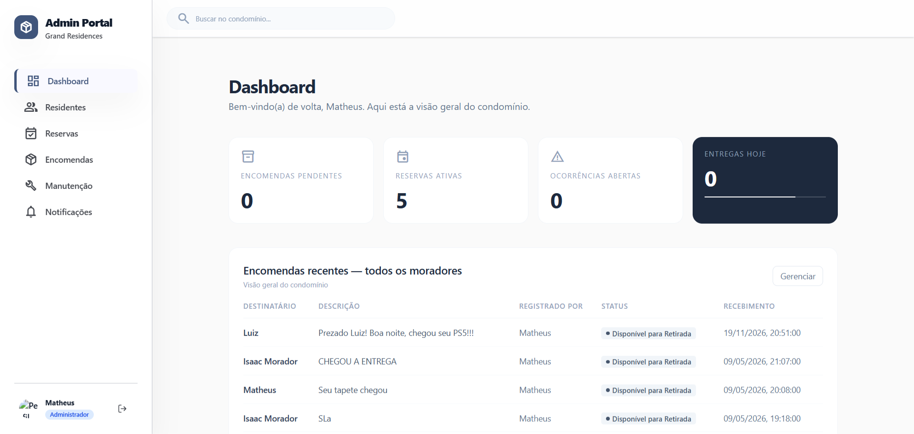

Quando o usuário tiver acessado a plataforma, cairá na tela de dashboard. Nesta tela, o usuário poderá navegar para as outras telas por meio da barra de navegação lateral ou pelo conteúdo central. O usuário pode navegar para a tela de reservas, ocorrências ou gestão. Ao clicar sobre avisos aparecerá um conteúdo de modal mostrando as notificações existentes para o usuário.

Na parte inferior esquerda, o usuário pode checar as notificações mais recentes. Na parte inferior direita, o usuário pode checar pelas reservas mais próximas feitas por ele. No final da parte inferior direita é possível verificar o gerenciamento do consumo de recursor e compará-lo com a média.

Para acessar a tela do menu de notificações é possível clicar no ícone de notificação na barra superior, ao lado da barra de pesquisa. Para acessar ao menu de configurações principal, o usuário precisará clicar no ícone de engrenagem, sendo 
redirecionado para a tela de configurações.

### Encomendas


Na tela de encomendas, o usuário pode verificar informações sobre as entregas que chegaram no condomínio.

#### Criação de Encomendas


Um administrador pode criar uma encomenda clicando no botão de nova encomenda. Ao fazer isso será mostrada uma modal com os campos para criar uma encomenda com as informações preenchidas. Para cancelar a operação, basta o usuário clicar no ícone de "X" ou pressionar o botão de cancelar. Após o usuário pressionar o botão de registrar encomenda, a modal será fechada e o usuário retornará à tela anterior com os dados já atualizados.

#### Filtro de Encomendas


Ao clicar no botão de filtrar na tela de encomendas, será aberta uma modal contendo campos para filtrar as encomendas. Para fechar a modal e retornar ao estado anterior da tela basta clicar no ícone "X" ou no botão de cancelar. Para aplicar os filtros de acordo com os campos da modal basta clicar no botão de salvar alterações, o que fechará a modal e retornará para a aplicação normalmente.


#### Relatório de Encomendas

Ao clicar no botão de relatório na tela de encomendas, aparecerá uma modal com as informações resumidas da encomenda. Para fechar esta modal e retornar à tela anterior, basta clicar no botão de fechar ou no ícone "X".

### Configuração


Na tela de configuração, o usuário pode alterar a foto de perfil, o nome completo, o nome corporativo e o cargo escolhido. Após as alterações, basta clicar em "Salvar Alterações". Ao salvar as alterações o usuário é redirecionado para a página anterior e as alterações são efetivadas. Para simplesmente voltar à tela anterior e não alterar nada, basta clicar em "Cancelar".


### Modal Notificações
[Inserir tela aqui]

[Texto sobre a tela aqui]


### Configurações de Perfil


Ao clicar sobre a parte na sidebar que contém o nome e o perfil do usuário, aparecerá a modal de configurações do perfil. Nela é possível que o usuário altere seu nome e email através dos inputs. Um usuário que seja morador não pode alterar seu cargo, sendo que apenas administradores podem modificar esse campo. Uma vez que o usuário tenha terminado a edição, basta pressionar o botão de salvar alterações. Quando as alterações forem salvas, a modal se fecha e o usuário é encaminhado de volta para a tela onde estava antes de clicar para modificar seus dados de perfil.

### Residentes

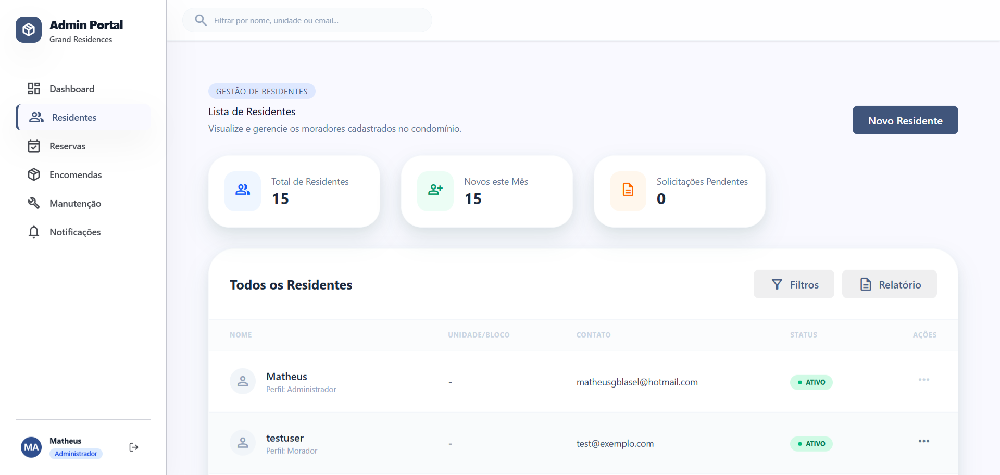

Na tela de gestão, o usuário com perfil de administrador pode gerenciar todos os usuários existentes no condomínio. É possível filtrar os usuários por nome ou cpf, bloco e unidade. O administrador pode atualizar o status do perfil do usuário para inativo ou ativo. Na parte mais inferior da tela, pode-se verificar a quantidade de usuários cadastrados no sistema, a quantidade de ativos e a quantidade de perfis pendentes para aprovação.

Pode-se criar no botão "Novo Usuário" para abrir a modal de adicionar um perfil de usuário ao sistema.

É possível clicar nos ícones de edição e lixeira, respectivamente, para abrir as modais de edição sobre as informações do usuário e o popup de confirmação da exclusão de um perfil do sistema.

O usuário pode clicar nos números de paginação para navegar para tabelas com as informações sobre outros usuários. 

### Modal Criação Usuário
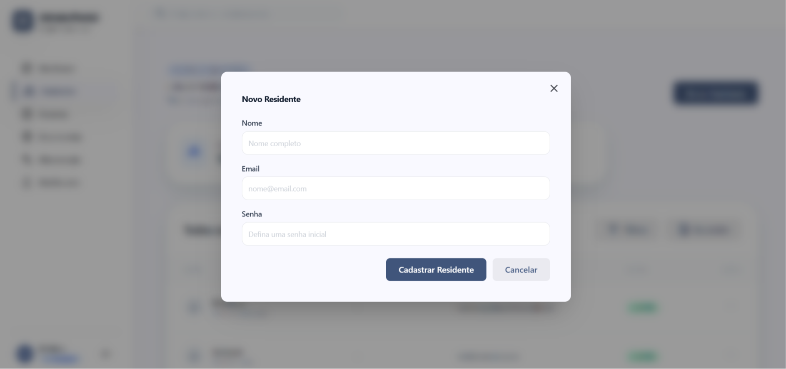

Ao abrir a modal de criar um usuário, as informações de nome completo, email, cpf, bloco, unidade e perfil podem ser preenchidas. Ao clicar em "Cadastrar" a modal será fechada e a página atualizada com o novo usuário. Para cancelar a operação e fechar a modal, basta clicar em "Cancelar".

### Modal Edição Usuário

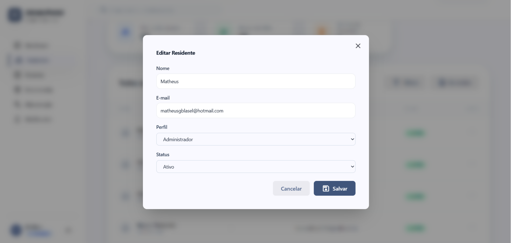

Ao abrir a modal de edição das informações de um usuário cadastrado no sistema, é possível verificar suas principais informações de cadastro. O nome completo, endereço de email, unidade, perfil de acesso e status da conta são visíveis para o administrador verificar informações e operar edições sobre esses valores. Ao clicar em "Salvar Alterações", o sistema atualiza o usuário com as informações preenchidas nos campos. Ao clicar em "Cancelar" a modal é fechada.

### Popup Exclusão Usuário

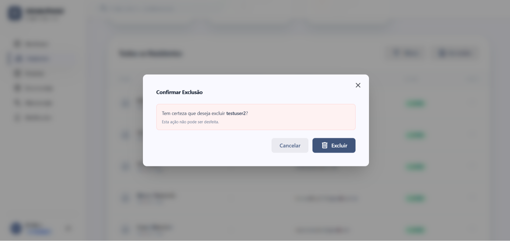

O usuário com perfil administrador pode confirmar a exclusão do usuário do sistema através da confirmação do popup. Para isso, basta clicar em "Confirmar". Para cancelar a operação, basta clicar em "Cancelar". Ao cancelar o usuário volta à tela original. Ao confirmar, a página é atualizada e o usuário selecionado é removido da tabela de usuários.

### Manutenção (Ocorrências)

A tela de manutenção (referenciada internamente como Ocorrências) é o canal onde os problemas estruturais ou de convivência são reportados e geridos. O sistema adapta a visualização de acordo com o perfil logado, garantindo privacidade ao morador e controle total ao administrador.

#### Minhas Ocorrências (Perfil Morador)

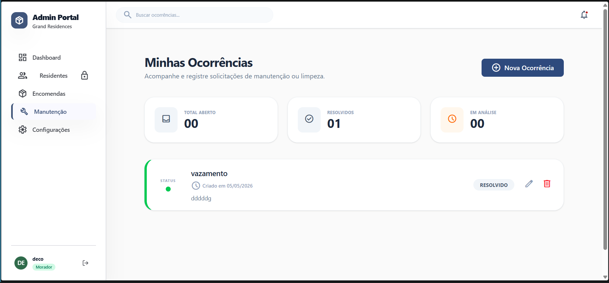

Ao acessar o menu de manutenção, o morador é direcionado para a tela "Minhas Ocorrências". Nesta área, ele pode acompanhar o histórico de suas solicitações através de cards que exibem o título, a data de criação e a descrição do problema. No topo da página, cards de resumo indicam a quantidade de chamados abertos, resolvidos e em análise do próprio usuário.

#### Criação de Ocorrência

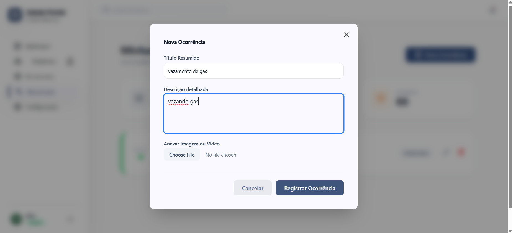

Para registrar um novo problema, o morador deve clicar no botão **"Nova Ocorrência"**. Ao fazer isso, uma modal será exibida com campos para inserir um título resumido e a descrição detalhada do incidente. O usuário também tem a opção de anexar fotos ou vídeos para comprovar o ocorrido. Para cancelar a operação, basta clicar no ícone de "X" no topo da modal ou no botão "Cancelar". Ao clicar em **"Registrar Ocorrência"**, os dados são enviados e a lista é atualizada.

#### Edição e Acompanhamento

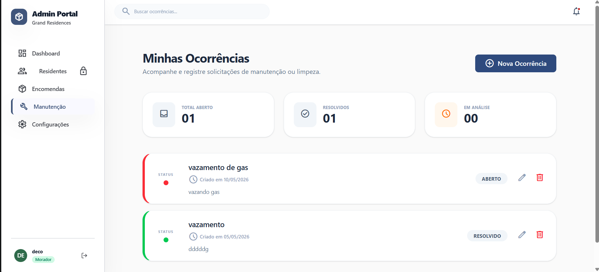

Após o registro, a ocorrência aparece com o status **"ABERTO"** (indicado por uma barra lateral vermelha). O morador pode clicar no ícone de lápis para editar as informações caso tenha esquecido algum detalhe, ou no ícone de lixeira para remover o chamado.

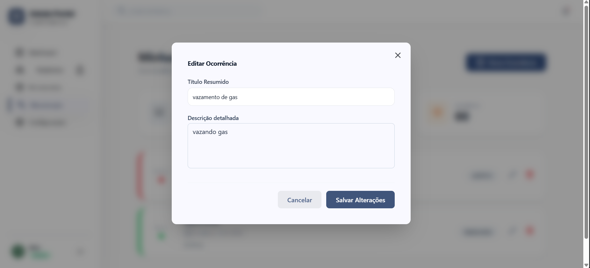

Na modal de edição, o usuário altera o conteúdo desejado e clica em **"Salvar Alterações"** para atualizar o chamado, ou "Cancelar" para manter os dados originais.

---

#### Gestão de Ocorrências (Perfil Administrador)

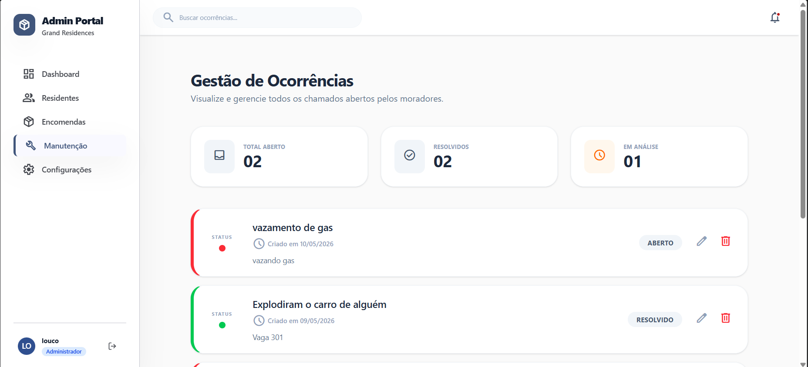

Quando um usuário com perfil de administrador acessa o módulo, ele visualiza a "Gestão de Ocorrências". Diferente do morador, o administrador enxerga todos os chamados abertos no condomínio. Os indicadores superiores refletem o volume total de trabalho da administração, facilitando o controle de demandas pendentes.

#### Gerenciamento de Status

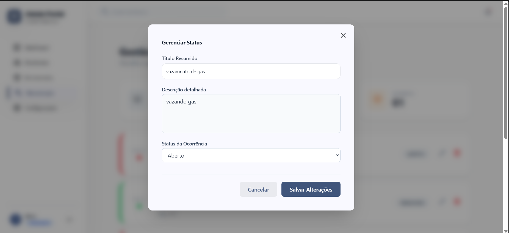

O administrador pode operar edições sobre as ocorrências para atualizar o progresso do reparo. Ao clicar no ícone de edição de um chamado, a modal **"Gerenciar Status"** é aberta. Nela, além de visualizar os detalhes enviados pelo morador, o administrador pode alterar o campo "Status da Ocorrência" através de uma lista de seleção (Aberto, Em Andamento, Resolvido).

#### Atualização e Conclusão

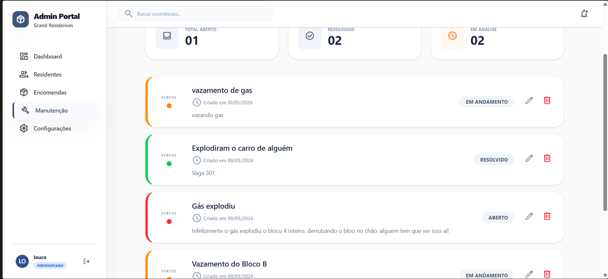

Ao selecionar um novo status e clicar em **"Salvar Alterações"**, o sistema atualiza o chamado e altera sua cor de identificação. Por exemplo, ao mudar para **"EM ANDAMENTO"**, a barra lateral torna-se laranja; ao mudar para **"RESOLVIDO"**, a barra torna-se verde, sinalizando ao morador que a demanda foi concluída. Assim como nas outras telas, o administrador pode cancelar a operação a qualquer momento clicando em "Cancelar" ou no "X" da modal.

## Tecnologias Utilizadas

Para o desenvolvimento da interface da aplicação web, de acordo com a proposta do projeto, foram selecionadas as seguintes tecnologias:

### ⚛️ React
Biblioteca que permite a construção de interfaces de usuário de forma declarativa, integrando HTML (JSX) com JavaScript. Possibilita o gerenciamento de estado e a criação de componentes reutilizáveis, tornando a aplicação mais dinâmica e escalável.

### 🎨 Tailwind CSS
Framework de estilização CSS baseado em classes utilitárias predefinidas. Permite a construção rápida de interfaces modernas diretamente no HTML, promovendo consistência visual e alta produtividade no desenvolvimento.


## Considerações de Segurança

Autenticação
O sistema utiliza JWT (JSON Web Token) com algoritmo HMAC-SHA256 para autenticação. Os tokens são gerados pelo JwtGen no backend com validade de 8 horas e carregam as claims de userId, role, username e email. No frontend, o token é armazenado no localStorage e enviado em toda requisição via header Authorization: Bearer.
Autorização
O controle de acesso é feito por perfis (Administrador e Morador) usando o atributo [Authorize(Roles = "...")] nos controllers ASP.NET. Endpoints sensíveis como criação, edição e exclusão de áreas comuns e usuários são restritos ao perfil Administrador. O frontend reforça essa separação exibindo visões distintas no dashboard conforme o perfil do usuário autenticado.
Proteção de dados
Senhas não são armazenadas em texto puro. A comunicação com o banco de dados utiliza parâmetros nomeados (@param) em todas as queries, prevenindo injeção de SQL. Campos sensíveis como created_at e updated_at são marcados com [JsonIgnore] e não são expostos na API.
Proteção contra ataques
As queries ao banco utilizam exclusivamente NpgsqlCommand com parâmetros, eliminando vulnerabilidades de SQL Injection. O backend trata exceções do PostgreSQL (ex: violação de unicidade 23505) de forma controlada, sem expor detalhes internos do banco ao cliente.

## Implantação

## 1. Requisitos de Hardware e Software (Produção)

### 1.1 Requisitos de Hardware

Como o frontend é uma aplicação web estática (gerada após build), os requisitos são baixos.

Requisitos mínimos recomendados:

- **CPU:** 1 vCPU
- **Memória RAM:** 512 MB (recomendado 1 GB)
- **Armazenamento:** 1 GB SSD (ou mais, dependendo de logs e cache do servidor)
- **Rede:** conexão estável com acesso público (HTTP/HTTPS)

> Observação: caso a hospedagem seja feita em plataformas como Vercel/Netlify/Render, a infraestrutura fica sob responsabilidade do provedor.

---

### 1.2 Requisitos de Software

Para gerar o build e executar a aplicação em produção, é necessário:

- **Node.js (LTS recomendado, ex: Node 18+)**
- **npm** (ou yarn)
- Dependências definidas no `package.json`
- Servidor para arquivos estáticos (exemplos):
  - Nginx
  - Apache
  - Serviços gerenciados como Vercel, Netlify ou Render
---  
## 2. Escolha da Plataforma de Hospedagem

Para o frontend web, as plataformas mais indicadas são:

### Opções recomendadas

- **Vercel** (ideal para React, integração direta com GitHub)
- **Netlify** (deploy rápido, CDN e SSL automático)
- **Render (Static Site)** (deploy automático e fácil configuração)
- **GitHub Pages** (boa opção para projetos acadêmicos)

### Recomendação principal
Para facilidade e estabilidade, recomenda-se **Vercel** ou **Netlify**, pois ambas oferecem:
- Deploy automático por push no GitHub
- HTTPS automático
- CDN global
- Configuração simples
---
## 3. Configuração do Ambiente de Implantação

### 3.1 Clonar o Repositório

```bash
git clone https://github.com/ICEI-PUC-Minas-PMV-SI/pmv-si-2026-1-pe6-t1-t1-g2-sistema-de-gestao-de-condominios.git
```
### 3.2 Acessar a Pasta do Frontend

Após clonar o repositório, acesse o diretório do frontend:

```bash
cd pmv-si-2026-1-pe6-t1-t1-g2-sistema-de-gestao-de-condominios/src/frontend-webe
```
### 3.3 Instalar Dependências

Dentro da pasta do frontend, execute:

```bash
npm install
```
Ou, caso utilize yarn:
```bash
yarn install
```
### 3.4 Configurar Variáveis de Ambiente

Caso o projeto consuma uma API backend, recomenda-se definir variáveis de ambiente.

Exemplo: criar arquivo `.env.production` na raiz do frontend:

```env
REACT_APP_API_URL=https://api.seudominio.com
```
### 3.5 Gerar Build de Produção

Execute o comando abaixo para gerar a versão otimizada para produção:
```bash
npm run build
```
Após esse comando, será gerada uma pasta chamada build/ contendo os arquivos estáticos otimizados.

---

## 4. Deploy da Aplicação na Plataforma Escolhida
A seguir estão as instruções conforme o tipo de hospedagem.

### 4.1 Deploy na Vercel (Recomendado)
- Acesse: https://vercel.com
- Faça login (pode usar GitHub).
- Clique em New Project.
- Selecione o repositório do GitHub.
- Configure o projeto:
    - Root Directory: src/frontend-webe
    - Build Command: npm run build
    - Output Directory: build
- Clique em Deploy.
- A Vercel irá gerar automaticamente uma URL pública.

### 4.2 Deploy na Netlify
- Acesse: https://www.netlify.com
- Faça login e conecte ao GitHub.
- Clique em Add new site → Import an existing project
- Selecione o repositório.
- Configure:
    Base directory: src/frontend-webe
    Build command: npm run build
    Publish directory: src/frontend-webe/build
- Clique em Deploy site.
- O Netlify disponibilizará uma URL pública.

### 4.3 Deploy na Render (Static Site)
- Acesse: https://render.com
- Crie um novo serviço Static Site.
- Conecte ao GitHub e selecione o repositório.
- Configure:
    - Root Directory: src/frontend-webe
    - Build Command: npm run build
    - Publish Directory: build
- Clique em Create Static Site.

### 4.4 Deploy em Servidor Próprio (Nginx/Apache)
Passo 1: Gerar build localmente
```bash
npm run build
```
Passo 2: Copiar pasta build para o servidor

Exemplo via SCP:
```bash
scp -r build/ usuario@servidor:/var/www/frontend
```
Passo 3: Configurar Nginx
Exemplo de configuração em /etc/nginx/sites-available/frontend:
```nginx
server {
    listen 80;
    server_name seudominio.com;

    root /var/www/frontend;
    index index.html;

    location / {
        try_files $uri /index.html;
    }
}
```
Ativar e reiniciar:
```bash
sudo ln -s /etc/nginx/sites-available/frontend /etc/nginx/sites-enabled/
sudo nginx -t
sudo systemctl restart nginx
```
### 4.5 Deploy no GitHub Pages
Passo 1: Instale o pacote gh-pages:
```bash
npm install gh-pages --save-dev
```
Passo 2: No package.json, configure:
```json
"homepage": "https://seuusuario.github.io/nome-do-repo"
```
Passo 3: Adicione scripts:
```json
"scripts": {
  "predeploy": "npm run build",
  "deploy": "gh-pages -d build"
}
```
Passo 4: Execute:
```bash
npm run deploy
```
---
# 5. Testes Pós-Deploy (Validação em Produção)

Após a implantação, é necessário validar o funcionamento completo do sistema em ambiente de produção.

---

## 5.1 Testes Básicos

- Abrir a URL do sistema e verificar se o carregamento ocorre corretamente.
- Verificar se páginas e menus estão funcionando.
- Testar navegação entre telas.
- Validar responsividade em dispositivos móveis (utilizando o modo responsivo do navegador).

---

## 5.2 Testes de Integração com Backend (Se existir)

- Verificar se a aplicação consegue consumir a API (login, cadastros, consultas).
- Conferir se o endpoint configurado na variável `REACT_APP_API_URL` está correto.
- Validar mensagens de erro e tratamento de falhas.

---

## 5.3 Testes de Console e Performance

Abrir o **DevTools** do navegador e verificar:

- Erros no **Console**
- Falhas de requisição (aba **Network**)
- Tempo de carregamento e tamanho dos arquivos

---

## 5.4 Teste de Rotas SPA (React Router)

Se o projeto utiliza **React Router**, é obrigatório garantir que a plataforma redirecione todas as rotas para o `index.html`.

### Exemplo

caso acesse `dashboard` diretamente e dê erro 404, deve-se configurar redirects/rewrite na hospedagem.

## Testes

# Estratégia de Testes Frontend

## 1. Testes Unitários

### Objetivo
Validar o comportamento de partes isoladas do código (funções, componentes e hooks), assegurando que cada unidade funcione corretamente sem dependências externas.

### O que testar
- Funções utilitárias (ex.: formatação de dados)
- Componentes React isolados (renderização e lógica interna)
- Estados e chamadas internas

### Ferramentas recomendadas
- **Vitest** – executor moderno de testes para projetos com Vite (que o frontend já usa); rápido e com suporte nativo a TypeScript.
- **Jest** – tradicional no ecossistema JavaScript/React, com ampla comunidade e fácil integração com mocks.
- **@testing-library/react** – biblioteca para testar componentes React com foco no comportamento visível para o usuário.
- **Sinon.js (ou similares)** – para spies/mocks/stubs quando necessário simular dependências.

---

## 2. Testes de Integração

### Objetivo
Verificar a interação entre múltiplos componentes ou entre frontend e APIs (mockadas/estágios controlados), garantindo que as integrações estejam funcionando.

### O que testar
- Formulários que enviam dados e lidam com respostas
- Fluxos completos envolvendo múltiplos componentes trabalhando juntos
- Comunicação com o backend (usando mocks para simular endpoints)

### Ferramentas recomendadas
- **Vitest + @testing-library/react** – usando renderização real de componentes que interagem entre si.
- **Mock Service Worker (MSW)** – para interceptar chamadas de rede e simular respostas de API sem depender de servidores reais.
- **React Testing Library** – foco na experiência do usuário e interação entre componentes.

---

## 3. Testes End-to-End (E2E)

### Objetivo
Validar o sistema completo como um usuário real faria, navegando na interface, realizando cadastros/login e verificando respostas visuais e de lógica.

### O que testar
- Fluxos críticos (login, logout, navegação entre páginas)
- Cenários complexos de UI
- Interação com backend real ou ambiente de staging

### Ferramentas recomendadas
- **Playwright** – suporte a múltiplos navegadores, fácil de configurar e integração com CI.
- **Cypress** – muito utilizado para E2E em aplicações web, possui painel visual e bom suporte a testes interativos.

---

## 4. Testes de Carga / Performance

### Objetivo
Avaliar como a aplicação se comporta sob alta carga ou com muitos usuários simultâneos.

### O que testar
- Tempo de carregamento de telas com grande número de elementos
- Requisições simultâneas de API em painéis/dashboards
- Impacto de recursos pesados (listas, gráficos)

### Ferramentas recomendadas
- **k6** – open source para testes de carga em APIs e aplicações web.
- **Lighthouse** – análise de performance, acessibilidade e boas práticas (especialmente útil para frontend).
- **WebPageTest** – ferramenta externa para medir performance real em diferentes condições de conexão.

---

## 5. Testes Visuais / Regressão de UI

### Objetivo
Detectar mudanças indesejadas na interface antes de uma entrega.

### Ferramentas recomendadas
- **Chromatic** – baseado em Storybook, compara snapshots visuais para detectar diferenças.
- **Percy** – ferramenta de visual testing integrada com pipelines de CI.

---

## 6. Testes de Segurança Básicos

### Objetivo
Identificar vulnerabilidades comuns (XSS, CSRF, acessos indevidos).

### Ferramentas recomendadas
- **ESLint com plugins de segurança** (ex.: `eslint-plugin-security`)
- **Snyk / Dependabot** – para detecção de vulnerabilidades em dependências

# Referências

Inclua todas as referências (livros, artigos, sites, etc) utilizados no desenvolvimento do trabalho.
