# Front-end Web

O Front-end Web do projeto **Gestão Integrada de Condomínios** foi concebido para oferecer uma experiência clara, responsiva e eficiente aos perfis de **Morador** e **Administrador**. A interface centraliza os fluxos de autenticação, acompanhamento de informações do condomínio e execução de tarefas operacionais (como gestão de usuários, ocorrências, reservas e encomendas), reduzindo atritos da rotina condominial e aumentando a transparência entre administração e condôminos.

## Projeto da Interface Web

O projeto da interface web adota uma estrutura de navegação orientada a produtividade, com **barra lateral para acesso aos módulos principais**, **barra superior para ações globais** (busca, notificações e configurações) e **área central dinâmica** para apresentação de conteúdo. Esse padrão mantém consistência entre telas e reduz a curva de aprendizado, principalmente para o perfil administrativo que utiliza o sistema com maior frequência no desktop.

No fluxo de uso, as interações priorizam objetividade: formulários de autenticação com validação direta, tabelas com ações de edição e exclusão, modais para operações pontuais (cadastro, filtros, relatórios e confirmação), além de indicadores visuais de status para facilitar tomada de decisão. O desenho da interface também considera o contexto distribuído da solução, consumindo os serviços da API de forma organizada e mantendo o usuário informado sobre estados de carregamento, sucesso e erro.

### Wireframes

Os wireframes das páginas principais foram definidos para representar o fluxo completo de uso da plataforma, desde o acesso inicial até os módulos de operação. A composição prioriza hierarquia visual, navegação lateral persistente e blocos funcionais com ações bem delimitadas.

As principais telas modeladas são:
- **Login e Cadastro:** entrada segura na plataforma, com fluxo de autenticação e criação de conta.
- **Dashboard:** visão geral com atalhos para ações frequentes e acompanhamento de informações relevantes.
- **Reservas e Ocorrências:** áreas focadas no registro e acompanhamento de solicitações dos moradores.
- **Gestão/Residentes:** interface administrativa para controle de usuários, permissões e status de contas.

Os wireframes utilizados nesta etapa estão documentados nas imagens anexadas ao trabalho e nas capturas de tela incorporadas ao documento (seções de fluxo de dados), que refletem a disposição dos elementos e os padrões de interação adotados.

#### Wireframes anexados
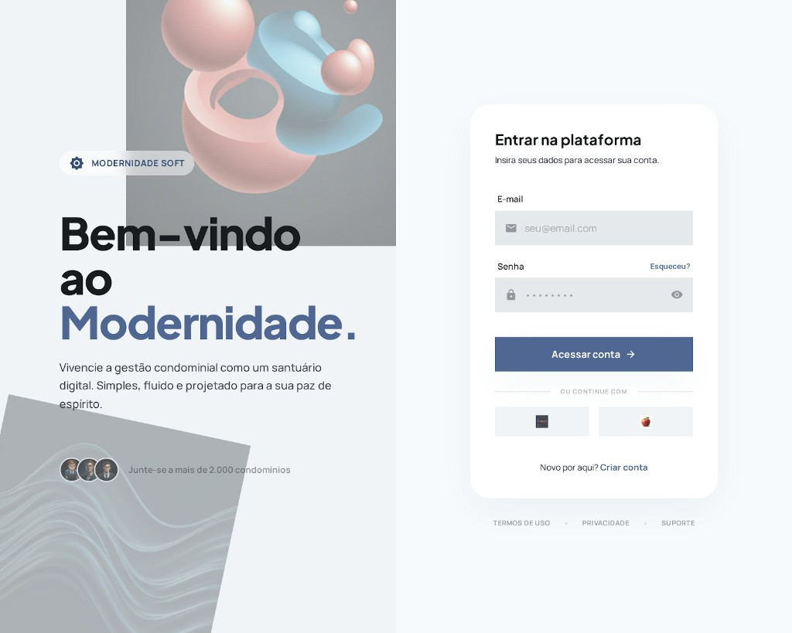

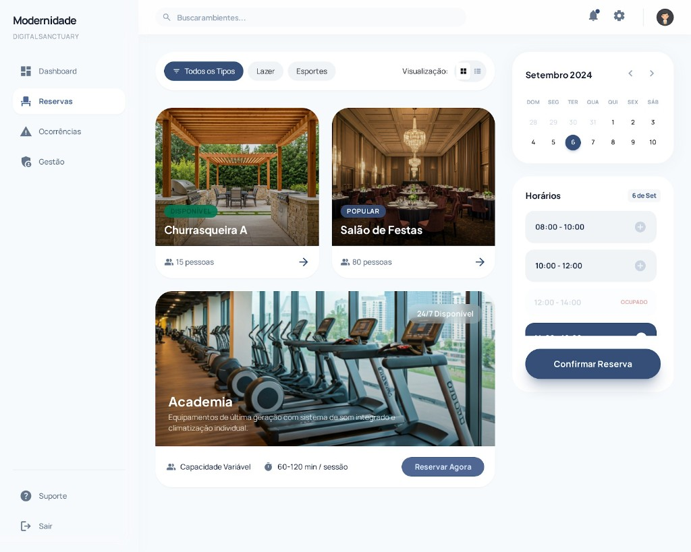

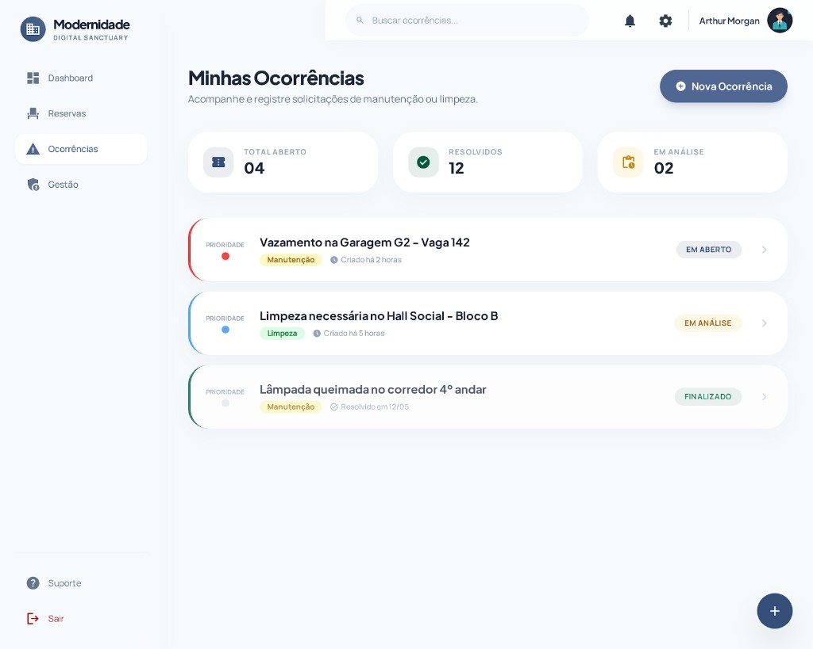

### Design Visual

O design visual segue uma linguagem moderna e limpa, com predominância de tons frios (variações de azul, cinza e branco), transmitindo confiabilidade e organização. O contraste foi planejado para favorecer legibilidade em formulários, tabelas, cards e indicadores de status, com uso de cores de apoio para destacar estados como ativo, pendente, em análise e concluído.

A tipografia sem serifa reforça a leitura em telas administrativas e melhora a escaneabilidade de informações densas. Os ícones têm papel funcional na navegação e nas ações rápidas (notificações, configurações, edição, exclusão e criação), enquanto elementos como cantos arredondados, espaçamento consistente e sombras suaves contribuem para uma experiência visual amigável sem comprometer o caráter profissional da aplicação.

## Fluxo de Dados

### User Flow Graph

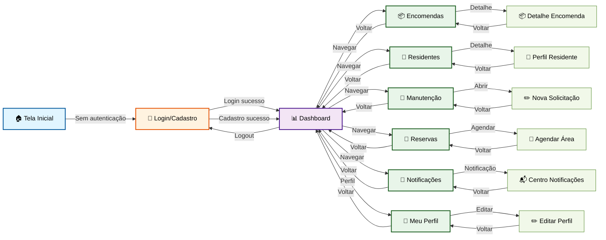
```mermaid
graph LR
    A["🏠 Tela Inicial"] -->|Sem autenticação| B["🔐 Login/Cadastro"]
    B -->|Login sucesso| C["📊 Dashboard"]
    B -->|Cadastro sucesso| C
    
    C -->|Navegar| D["📦 Encomendas"]
    C -->|Navegar| E["👥 Residentes"]
    C -->|Navegar| F["🔧 Manutenção"]
    C -->|Navegar| G["📅 Reservas"]
    C -->|Navegar| H["🔔 Notificações"]
    C -->|Perfil| I["👤 Meu Perfil"]
    
    D -->|Detalhe| D1["📦 Detalhe Encomenda"]
    E -->|Detalhe| E1["👥 Perfil Residente"]
    F -->|Abrir| F1["✏️ Nova Solicitação"]
    G -->|Agendar| G1["📅 Agendar Área"]
    H -->|Notificação| H1["📬 Centro Notificações"]
    I -->|Editar| I1["✏️ Editar Perfil"]
    
    D1 -->|Voltar| D
    E1 -->|Voltar| E
    F1 -->|Voltar| F
    G1 -->|Voltar| G
    H1 -->|Voltar| H
    I1 -->|Voltar| I
    
    D -->|Voltar| C
    E -->|Voltar| C
    F -->|Voltar| C
    G -->|Voltar| C
    H -->|Voltar| C
    I -->|Voltar| C
    
    C -->|Logout| B
    
    style A fill:#e1f5ff,stroke:#01579b,stroke-width:2px,color:#000
    style B fill:#fff3e0,stroke:#e65100,stroke-width:2px,color:#000
    style C fill:#f3e5f5,stroke:#4a148c,stroke-width:2px,color:#000
    style D fill:#e8f5e9,stroke:#1b5e20,stroke-width:2px,color:#000
    style E fill:#e8f5e9,stroke:#1b5e20,stroke-width:2px,color:#000
    style F fill:#e8f5e9,stroke:#1b5e20,stroke-width:2px,color:#000
    style G fill:#e8f5e9,stroke:#1b5e20,stroke-width:2px,color:#000
    style H fill:#e8f5e9,stroke:#1b5e20,stroke-width:2px,color:#000
    style I fill:#e8f5e9,stroke:#1b5e20,stroke-width:2px,color:#000
    style D1 fill:#f1f8e9,stroke:#558b2f,stroke-width:1px,color:#000
    style E1 fill:#f1f8e9,stroke:#558b2f,stroke-width:1px,color:#000
    style F1 fill:#f1f8e9,stroke:#558b2f,stroke-width:1px,color:#000
    style G1 fill:#f1f8e9,stroke:#558b2f,stroke-width:1px,color:#000
    style H1 fill:#f1f8e9,stroke:#558b2f,stroke-width:1px,color:#000
    style I1 fill:#f1f8e9,stroke:#558b2f,stroke-width:1px,color:#000
```

O diagrama acima representa o fluxo completo de navegação do usuário pela aplicação, mostrando todas as telas (frames) e as transições entre elas. As cores indicam: azul para tela inicial, laranja para autenticação, roxo para dashboard (hub central), verde para as seções principais e verde claro para detalhes e sub-telas.

### Login
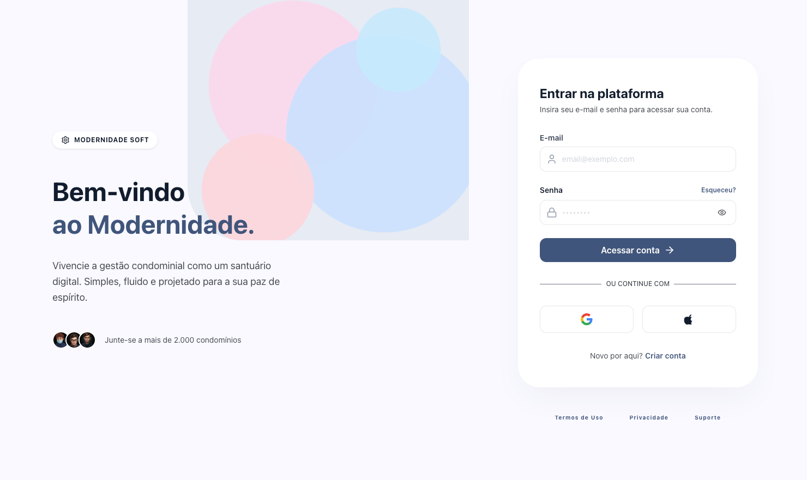

Ao acessar a tela de login, o usuário deverá inserir suas credenciais de email e senha e pressionar o botão "Acessar Conta" para efetuar o login na aplicação. Quando o usuário estiver logado, será redirecionado para a tela de dashboard da aplicação. Há um botão para o usuário criar sua conta caso ainda não tenha uma. Ao clicar para criar uma conta, será redirecionado para a tela de cadastro.

### Cadastro
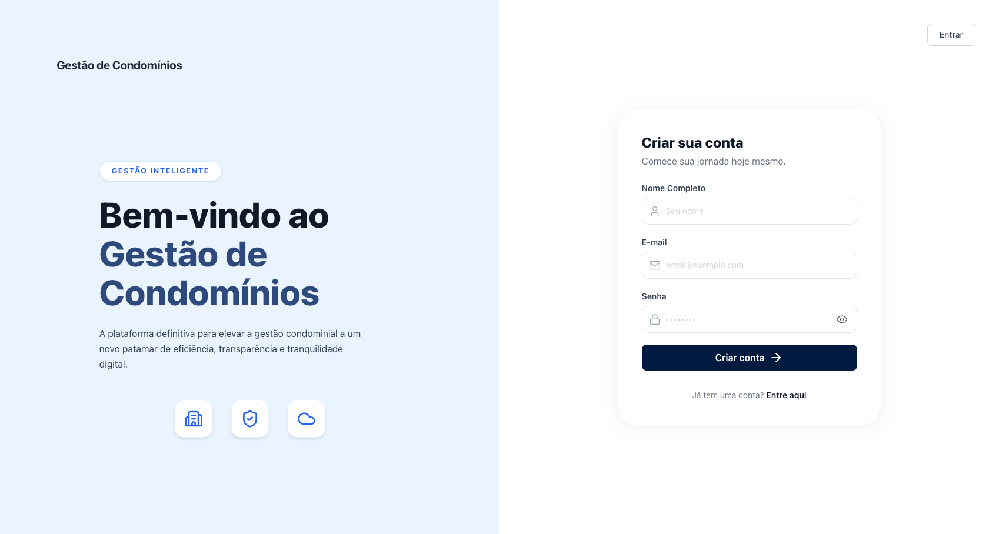

Ao acessar a tela de cadastro, o usuário deverá registar suas credenciais de nome, email e senha. Ao clicar em "Criar Conta", o usuário será redirecionado para a tela de login. Há as opções para cadastrar-se pelos provedores da Google ou Apple. Ao clicar para se cadastrar com o Google o usuário será encaminhado para a página de autenticação da Google. Ao clicar para se cadastrar com a Apple, o usuário será redirecionado para o site da Apple.

É possível ao usuário clicar na parte "Entrar" para ser redirecionado diretamente à página de Login.

### Dashboard

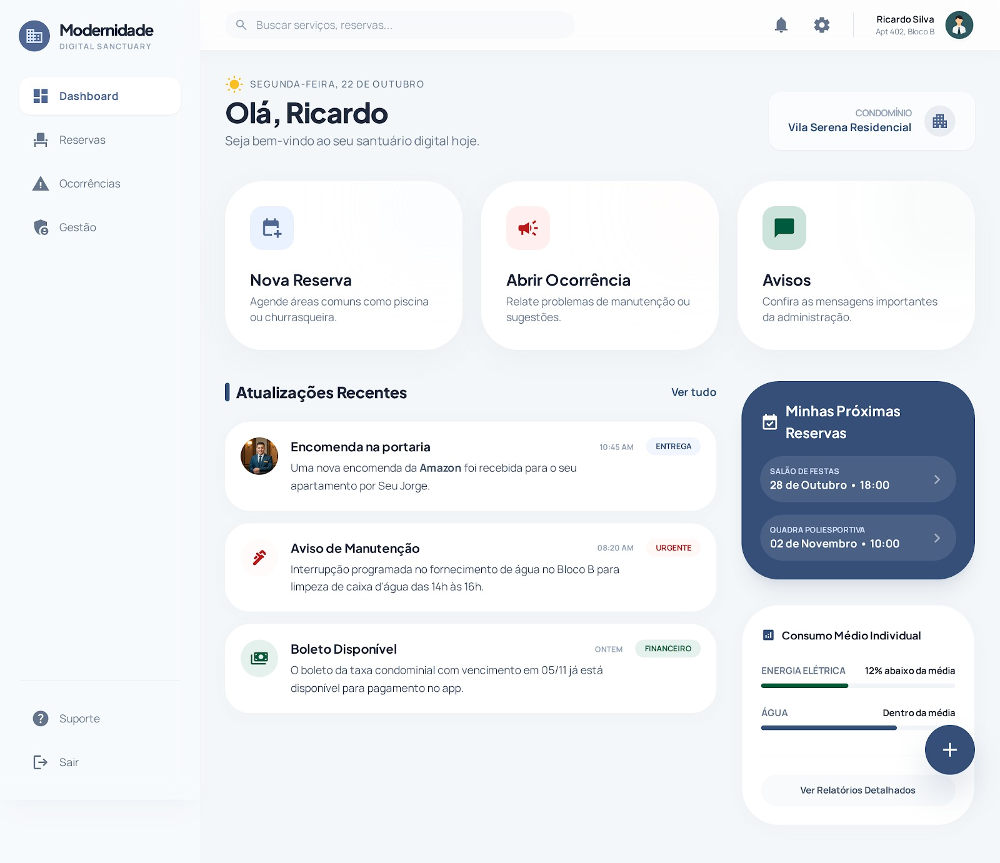

Quando o usuário tiver acessado a plataforma, cairá na tela de dashboard. Nesta tela, o usuário poderá navegar para as outras telas por meio da barra de navegação lateral ou pelo conteúdo central. O usuário pode navegar para a tela de reservas, ocorrências ou gestão. Ao clicar sobre avisos aparecerá um conteúdo de modal mostrando as notificações existentes para o usuário.

Na parte inferior esquerda, o usuário pode checar as notificações mais recentes. Na parte inferior direita, o usuário pode checar pelas reservas mais próximas feitas por ele. No final da parte inferior direita é possível verificar o gerenciamento do consumo de recursor e compará-lo com a média.

Para acessar a tela do menu de notificações é possível clicar no ícone de notificação na barra superior, ao lado da barra de pesquisa. Para acessar ao menu de configurações principal, o usuário precisará clicar no ícone de engrenagem, sendo 
redirecionado para a tela de configurações.

### Encomendas

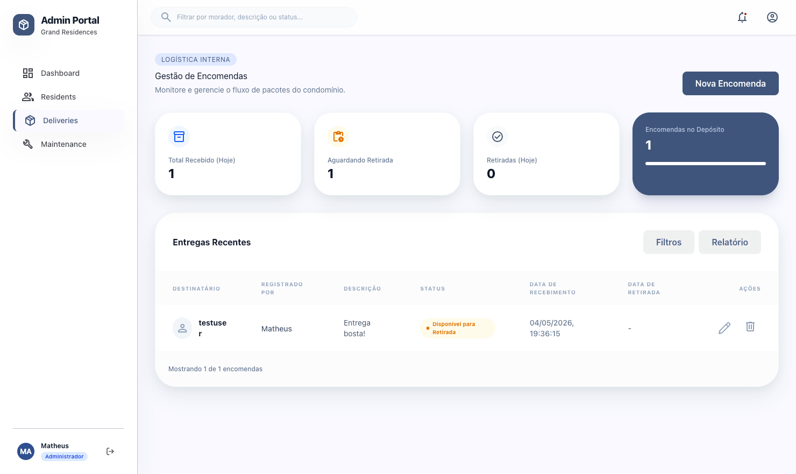

Na tela de encomendas, o usuário pode verificar informações sobre as entregas que chegaram no condomínio.

#### Criação de Encomendas
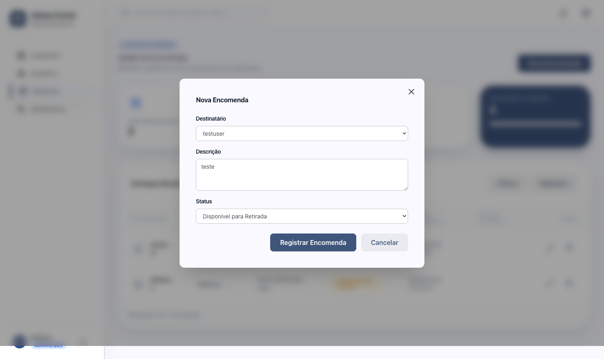

Um administrador pode criar uma encomenda clicando no botão de nova encomenda. Ao fazer isso será mostrada uma modal com os campos para criar uma encomenda com as informações preenchidas. Para cancelar a operação, basta o usuário clicar no ícone de "X" ou pressionar o botão de cancelar. Após o usuário pressionar o botão de registrar encomenda, a modal será fechada e o usuário retornará à tela anterior com os dados já atualizados.

#### Filtro de Encomendas

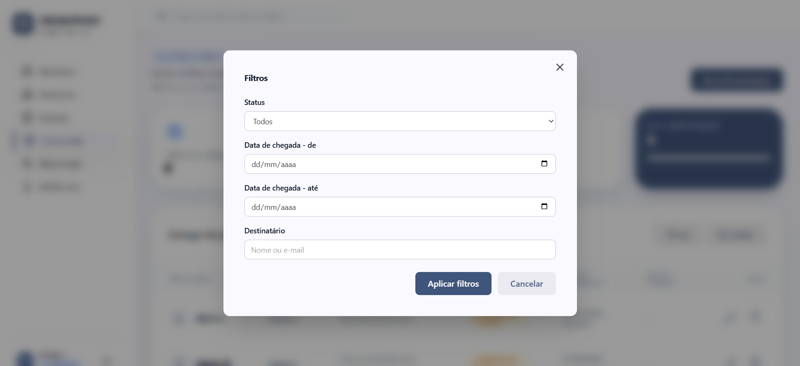

Ao clicar no botão de filtrar na tela de encomendas, será aberta uma modal contendo campos para filtrar as encomendas. Para fechar a modal e retornar ao estado anterior da tela basta clicar no ícone "X" ou no botão de cancelar. Para aplicar os filtros de acordo com os campos da modal basta clicar no botão de salvar alterações, o que fechará a modal e retornará para a aplicação normalmente.

#### Relatório de Encomendas
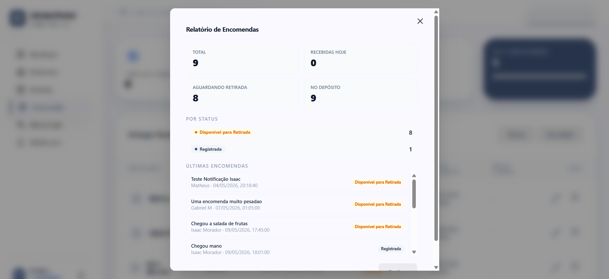
Ao clicar no botão de relatório na tela de encomendas, aparecerá uma modal com as informações resumidas da encomenda. Para fechar esta modal e retornar à tela anterior, basta clicar no botão de fechar ou no ícone "X".

### Configuração
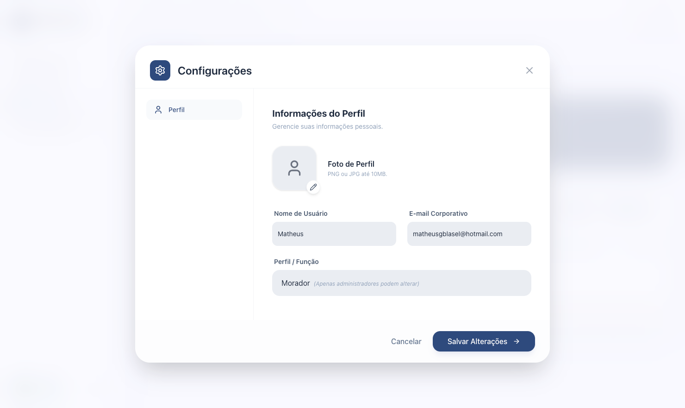

Na tela de configuração, o usuário pode alterar a foto de perfil, o nome completo, o nome corporativo e o cargo escolhido. Após as alterações, basta clicar em "Salvar Alterações". Ao salvar as alterações o usuário é redirecionado para a página anterior e as alterações são efetivadas. Para simplesmente voltar à tela anterior e não alterar nada, basta clicar em "Cancelar".

### Modal Avisos
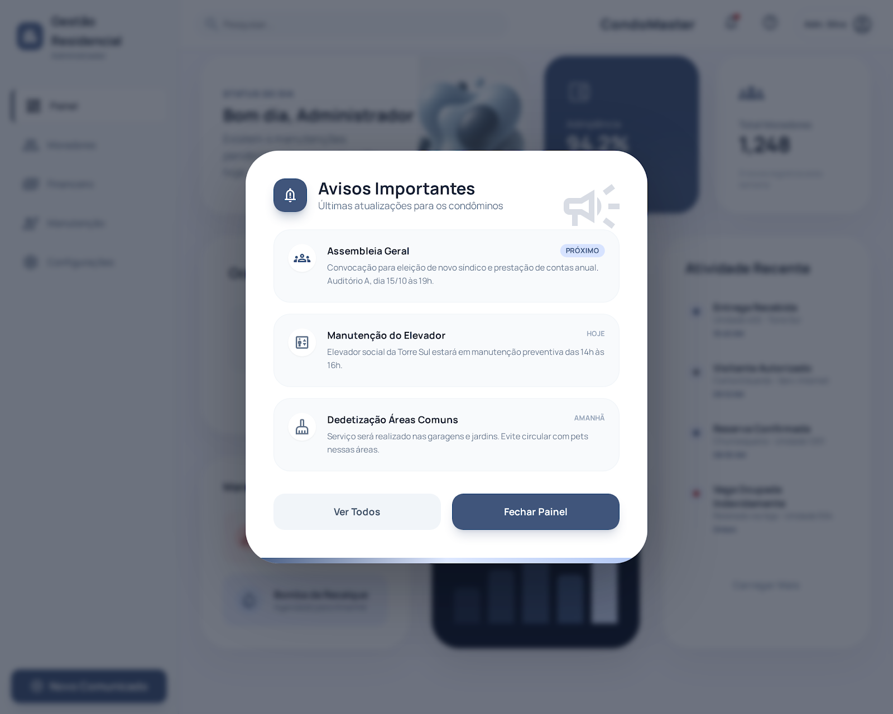

Uma vez que o usuário clique em avisos, na tela de dashboard, aparecerá uma modal contendo os avisos mais importantes por ordem de proximidade. O usuário pode pressionar no botão "Fechar Painel" para fechar a modal.

### Configurações de Perfil

Ao clicar sobre a parte na sidebar que contém o nome e o perfil do usuário, aparecerá a modal de configurações do perfil. Nela é possível que o usuário altere seu nome e email através dos inputs. Um usuário que seja morador não pode alterar seu cargo, sendo que apenas administradores podem modificar esse campo. Uma vez que o usuário tenha terminado a edição, basta pressionar o botão de salvar alterações. Quando as alterações forem salvas, a modal se fecha e o usuário é encaminhado de volta para a tela onde estava antes de clicar para modificar seus dados de perfil.

### Residentes

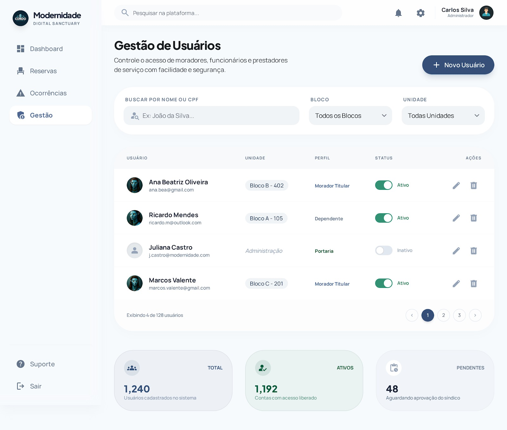

Na tela de gestão, o usuário com perfil de administrador pode gerenciar todos os usuários existentes no condomínio. É possível filtrar os usuários por nome ou cpf, bloco e unidade. O administrador pode atualizar o status do perfil do usuário para inativo ou ativo. Na parte mais inferior da tela, pode-se verificar a quantidade de usuários cadastrados no sistema, a quantidade de ativos e a quantidade de perfis pendentes para aprovação.

Pode-se criar no botão "Novo Usuário" para abrir a modal de adicionar um perfil de usuário ao sistema.

É possível clicar nos ícones de edição e lixeira, respectivamente, para abrir as modais de edição sobre as informações do usuário e o popup de confirmação da exclusão de um perfil do sistema.

O usuário pode clicar nos números de paginação para navegar para tabelas com as informações sobre outros usuários. 

### Modal Criação Usuário
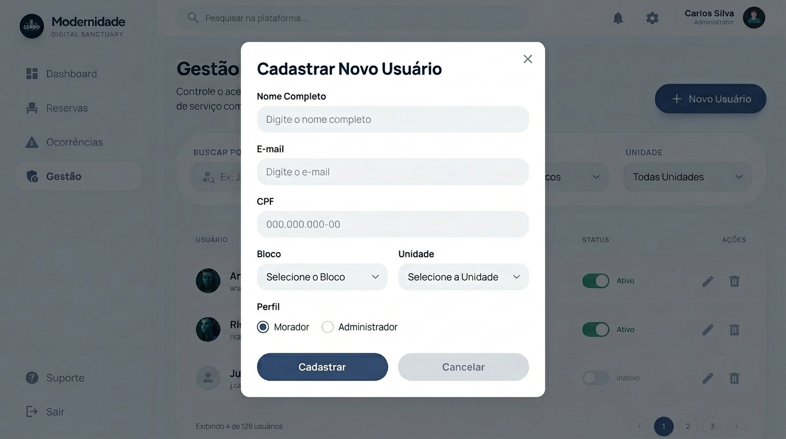

Ao abrir a modal de criar um usuário, as informações de nome completo, email, cpf, bloco, unidade e perfil podem ser preenchidas. Ao clicar em "Cadastrar" a modal será fechada e a página atualizada com o novo usuário. Para cancelar a operação e fechar a modal, basta clicar em "Cancelar".

### Modal Edição Usuário

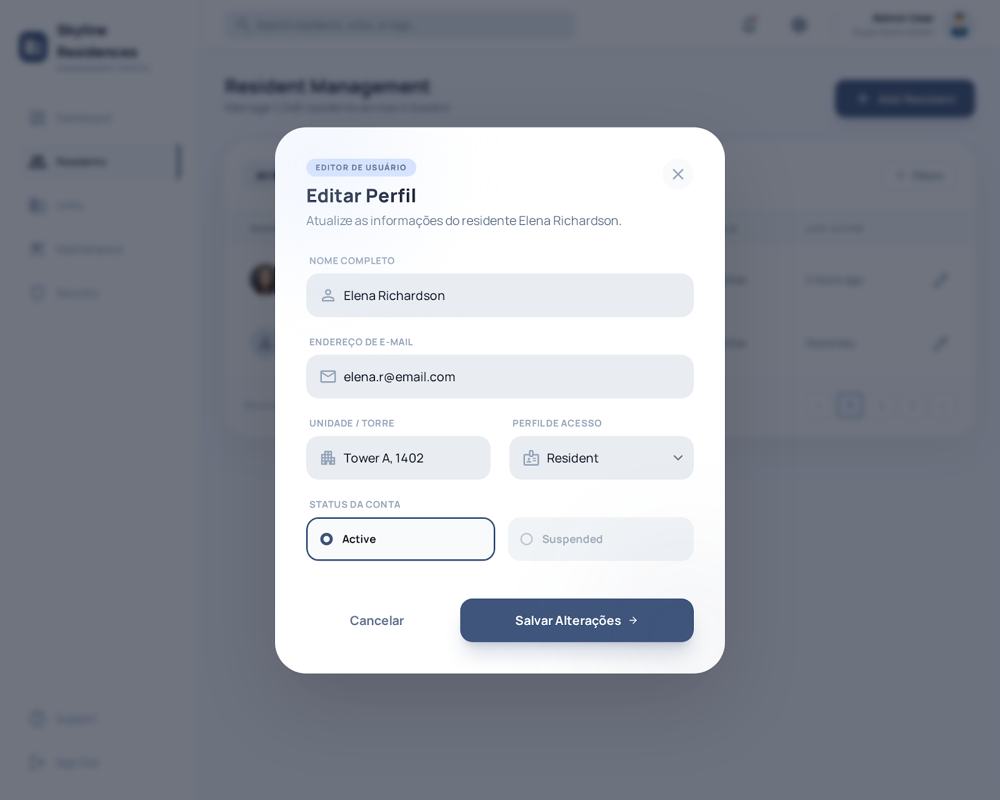

Ao abrir a modal de edição das informações de um usuário cadastrado no sistema, é possível verificar suas principais informações de cadastro. O nome completo, endereço de email, unidade, perfil de acesso e status da conta são visíveis para o administrador verificar informações e operar edições sobre esses valores. Ao clicar em "Salvar Alterações", o sistema atualiza o usuário com as informações preenchidas nos campos. Ao clicar em "Cancelar" a modal é fechada.

### Popup Exclusão Usuário

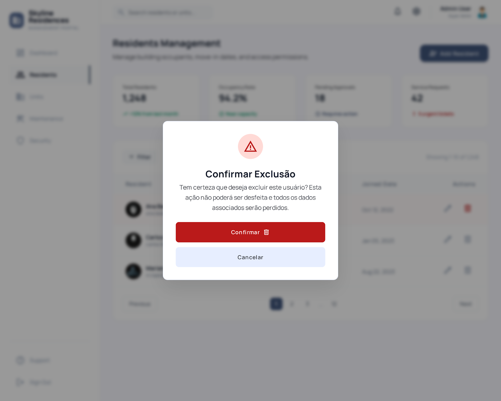

O usuário com perfil administrador pode confirmar a exclusão do usuário do sistema através da confirmação do popup. Para isso, basta clicar em "Confirmar". Para cancelar a operação, basta clicar em "Cancelar". Ao cancelar o usuário volta à tela original. Ao confirmar, a página é atualizada e o usuário selecionado é removido da tabela de usuários.

## Tecnologias Utilizadas

Para o desenvolvimento da interface da aplicação web, de acordo com a proposta do projeto, foram selecionadas as seguintes tecnologias:

### ⚛️ React
Biblioteca que permite a construção de interfaces de usuário de forma declarativa, integrando HTML (JSX) com JavaScript. Possibilita o gerenciamento de estado e a criação de componentes reutilizáveis, tornando a aplicação mais dinâmica e escalável.

### 🎨 Tailwind CSS
Framework de estilização CSS baseado em classes utilitárias predefinidas. Permite a construção rápida de interfaces modernas diretamente no HTML, promovendo consistência visual e alta produtividade no desenvolvimento.

## Considerações de Segurança

Autenticação
O sistema utiliza JWT (JSON Web Token) com algoritmo HMAC-SHA256 para autenticação. Os tokens são gerados pelo JwtGen no backend com validade de 8 horas e carregam as claims de userId, role, username e email. No frontend, o token é armazenado no localStorage e enviado em toda requisição via header Authorization: Bearer.
Autorização
O controle de acesso é feito por perfis (Administrador e Morador) usando o atributo [Authorize(Roles = "...")] nos controllers ASP.NET. Endpoints sensíveis como criação, edição e exclusão de áreas comuns e usuários são restritos ao perfil Administrador. O frontend reforça essa separação exibindo visões distintas no dashboard conforme o perfil do usuário autenticado.
Proteção de dados
Senhas não são armazenadas em texto puro. A comunicação com o banco de dados utiliza parâmetros nomeados (@param) em todas as queries, prevenindo injeção de SQL. Campos sensíveis como created_at e updated_at são marcados com [JsonIgnore] e não são expostos na API.
Proteção contra ataques
As queries ao banco utilizam exclusivamente NpgsqlCommand com parâmetros, eliminando vulnerabilidades de SQL Injection. O backend trata exceções do PostgreSQL (ex: violação de unicidade 23505) de forma controlada, sem expor detalhes internos do banco ao cliente.

## Implantação

[Instruções para implantar a aplicação distribuída em um ambiente de produção.]

1. Defina os requisitos de hardware e software necessários para implantar a aplicação em um ambiente de produção.
2. Escolha uma plataforma de hospedagem adequada, como um provedor de nuvem ou um servidor dedicado.
3. Configure o ambiente de implantação, incluindo a instalação de dependências e configuração de variáveis de ambiente.
4. Faça o deploy da aplicação no ambiente escolhido, seguindo as instruções específicas da plataforma de hospedagem.
5. Realize testes para garantir que a aplicação esteja funcionando corretamente no ambiente de produção.

## Testes

[Descreva a estratégia de teste, incluindo os tipos de teste a serem realizados (unitários, integração, carga, etc.) e as ferramentas a serem utilizadas.]

1. Crie casos de teste para cobrir todos os requisitos funcionais e não funcionais da aplicação.
2. Implemente testes unitários para testar unidades individuais de código, como funções e classes.
3. Realize testes de integração para verificar a interação correta entre os componentes da aplicação.
4. Execute testes de carga para avaliar o desempenho da aplicação sob carga significativa.
5. Utilize ferramentas de teste adequadas, como frameworks de teste e ferramentas de automação de teste, para agilizar o processo de teste.

# Referências

Inclua todas as referências (livros, artigos, sites, etc) utilizados no desenvolvimento do trabalho.
